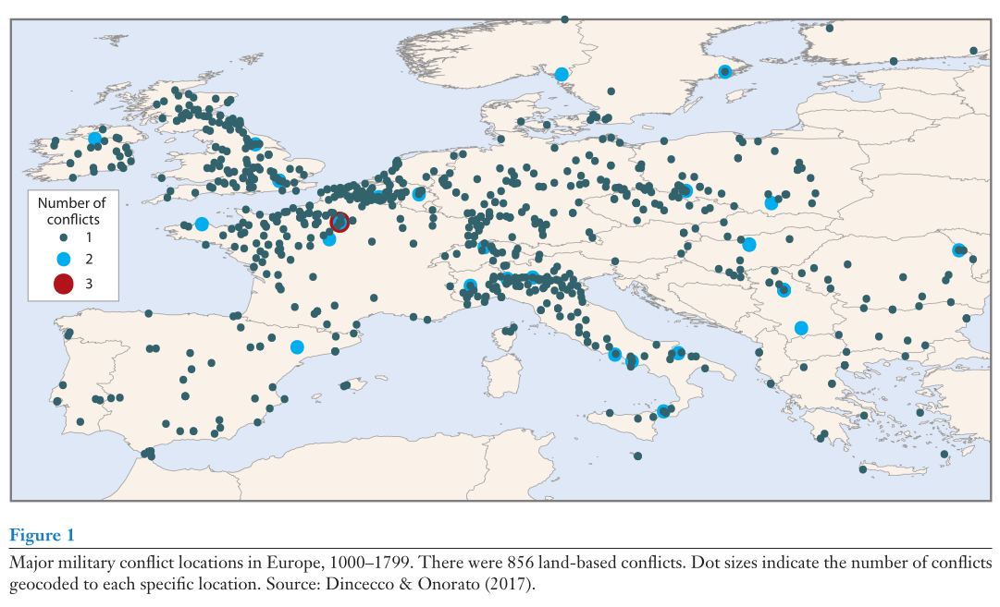
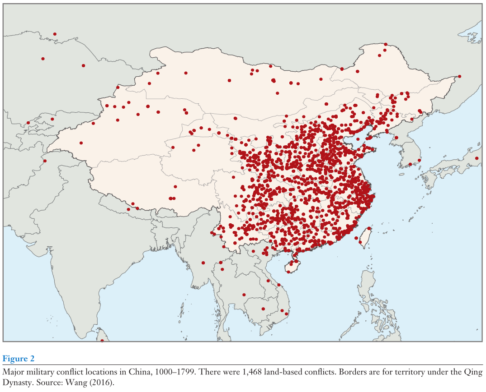
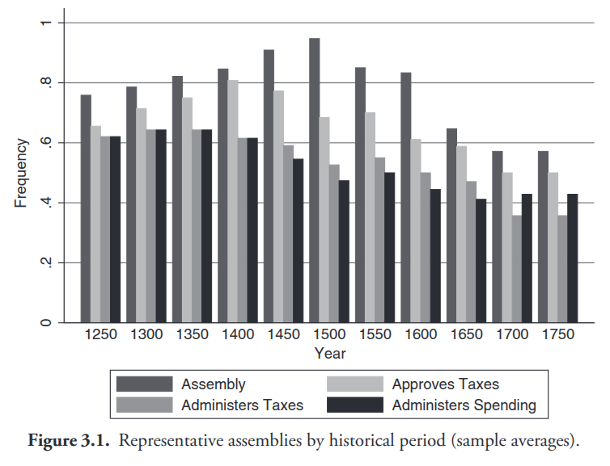
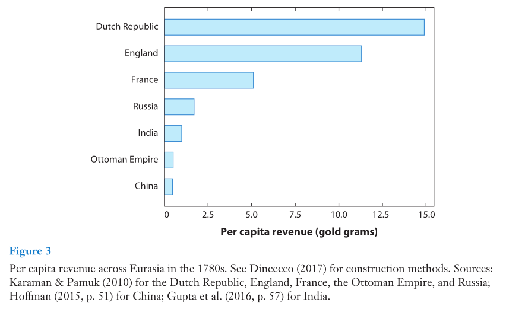
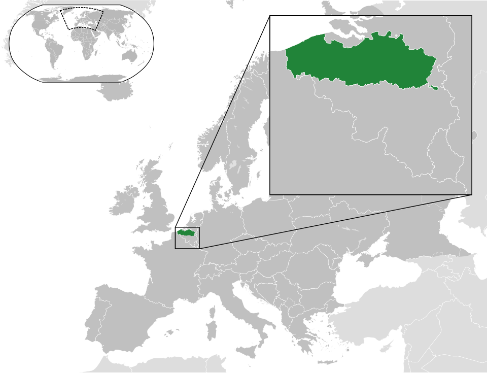
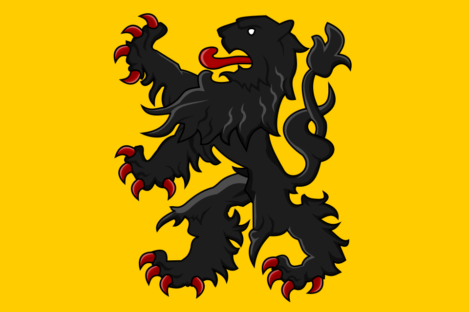
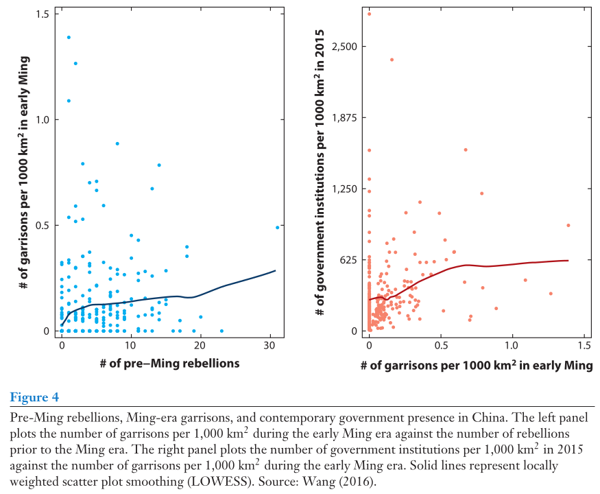

## Recap

Latin America as a "hard case" for Tilly outside Europe

- Few interstate wars, stable borders, yet sovereign states persisted
- Thies' alternative: interstate *rivalry* (threat of war) as driver of statebuilding
- Looked at the data: wars, rivalries, and tax ratios across South America 1900--2000
- Little robust evidence that war or rivalry drove state capacity in the region
- Takeaway: Tilly is a much better guide to Europe than to Latin America

## Today's agenda

1. The ruler--elite relationship: why even kings need help
2. Exit, voice, and loyalty as responses to ruler policy
3. How the exit option shaped state development differently in Europe vs. China

# Rulers, elites, and war

## What a ruler wants

::: {.columns}
:::: {.column}
{width="70%" fig-align="center"}
::::
:::: {.column}
Key objectives for a ruler

1. Stay in power

   - Internal threats
   - External threats

2. Consolidate control

   - Neutralize repeated threats
   - Raise more revenue

3. Expand territory

   - More resources to maintain power
   - Greater buffer vs external threats
::::
:::

## Even kings need support

Monarch's goals require cooperation from critical mass of **elites**

- Feudal era: Major landholders
- Modern period: Also major merchants, bankers
- These days: Also highest-ranking officers in standing military

Why can't they just govern on their own?

1. Need manpower

   - Defense against internal and external threats
   - Agricultural economies $\leadsto$ landholders must give up some labor

2. Need money

3. Elites best suited to pose internal threat (esp. historically)

## Why elites might withhold support

If the king asks for money to build up the army, why would the elites say no?

(Take a minute to chat about this)

. . .

 Is the cost worth the benefit?

   - Pressing external threat $\leadsto$ common interest in defense

   - Interests not so clearly aligned in case of offensive wars

. . .   

2. Will today's military buildup weaken the elite's power too much tomorrow?

   - Military is "dual use" --- fighting abroad, coercion at home

. . .   

3. Is the money *really* for the public defense?

   - "Incentive compatibility" problem: King wants revenue no matter what

   - e.g., Charles I and [ship money](https://en.wikipedia.org/wiki/Ship_money) in the 1630s

## Exit, voice, and loyalty

How can the elite respond when they don't like what the ruler is doing?

. . .

**Exit.**
Move oneself and/or one's wealth out of the country.

- Problem 1: Can these things be moved?
- Problem 2: Where to go? Will it be any better?

. . .

**Voice.**
Actively protest unwanted policies.

- Problem 1: Will the ruler listen?
- Problem 2: Costs and risks of a repressive/coercive response

. . .

**Loyalty.**
Push for improvement working within the system.

- Problem: How to change ruler incentives without causing some pain?

## Ruler strategies to manage elite dissent

Optimal strategy in part depends on anticipated mode of dissent

. . .

Anticipated elite **exit** $\leadsto$ **"carrot"** incentive to stay

- Make the loyalty option more attractive
- Short run concessions: favors, privileges, tax breaks
- Long run concessions: institutionalized power sharing
- Problem (especially for long run): credibility of ruler's promise

. . .

Anticipated elite **voice** $\leadsto$ **"stick"** of repression (preventive or reactive)

- Punish dissenters for interfering with ruler's policy
- Problem 1: Costly and risky escalation
- Problem 2: Might just push elite to exit if possible

## Predictions about war and ruler-elite relations

Where elite exit options are good:

1. War threats $\leadsto$ ruler concessions to elite
2. Long run outcome: power sharing

. . .

Where elite exit options are bad:

1. War threats $\leadsto$ repression or temporary co-optation
2. Long run outcome: coercive central state

. . .

Lingering question --- how do we know how good or bad the exit option is?

# Representation in Europe versus China

## Key question

Between 1000 and 1800, Europe and China both experienced plenty of war

Yet European states developed very differently from China

- More power sharing with elites, less coercion
- Greater extractive capacity

What does this tell us about the role of war in state development?

## Fact patterns: War

{fig-align="center"}

## Fact patterns: War {visibility="uncounted"}

{fig-align="center"}

## Fact patterns: War {visibility="uncounted"}

Lots of wars both places --- but important differences on closer look

1. Nature of war
   - Europe: majority were battles/sieges between interstate rivals
   - China: majority were rebellions or civil wars

2. Foes in external wars
   - Europe: virtually always other territorial states
   - China: 80% were nomadic invasions

## Fact patterns: State development

Institutional power for elites in Europe, no analogue in China

{fig-align="center"}

## Fact patterns: State development {visibility="uncounted"}

{fig-align="center"}

## Fragmentation and exit options

Key variable according to Dincecco and Wang: **political fragmentation**

- Many small countries in Europe (~85 average from 1000--1800)
- One large centralized state in China

. . .

Very different calculations facing dissatisfied elites in these places

- Unhappy in Europe?
  - Throw in with the rival next door
- Unhappy in the middle of China?
  - Where else are you going to go?
  - Do you expect the Mongol nomads to help you?

## Exit options in Europe: Flanders in the 1300s

::: {.columns}
:::: {.column}
Rich and economically important due to textile industry

Technically owed allegiance to France, but imported most wool from England

Political exit: Allied with English early in Hundred Years War, in hopes of securing better long-run treatment

Individual exit: Traders and weavers moved to England or other regional locales
::::
:::: {.column}
{fig-align="center" width="80%"}

{fig-align="center" width="60%"}
::::
:::

## Matching up with theoretical predictions

Europe: elite exit viable due to fragmentation

- Frequent interstate threats meant states needed money
- Got it through long-run power sharing arrangements with elites

China: no realistic exit option

- Conflicts tended to be internal, not external
- State responded with repression, increasing internal military presence
- ...or with temporary buyoffs like altering school quotas

## The stickiness of state presence in China

{fig-align="center"}

## Puzzle: why could the "weaker" states extract more?

China sounds like the stronger state, yet didn't raise nearly as much revenue from its subjects on a per capita basis

{fig-align="center"}

We'll return to this when we talk about war and parliamentary development

# Wrapping up

## What we did today

1. The ruler--elite relationship: why even kings need help
   - Rulers need manpower and money --- elites control both
   - Elites may resist if costs outweigh benefits or if military buildup threatens their power

2. Exit, voice, and loyalty as responses to ruler policy
   - Ruler strategy depends on anticipated mode of dissent: carrots for exit, sticks for voice
   - Availability of options depends on geography, economy

3. How the exit option shaped state development differently in Europe vs. China
   - Political fragmentation in Europe $\leadsto$ power sharing
   - Centralization in China $\leadsto$ repression and coercive central state

## To do for next time

No reading for Wednesday!  Just keep thinking about paper topics.
