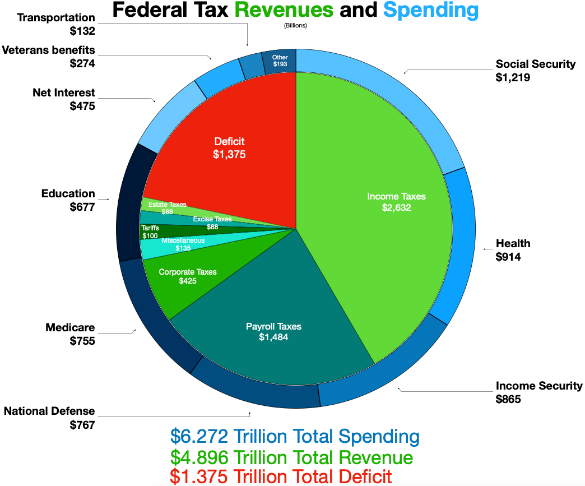
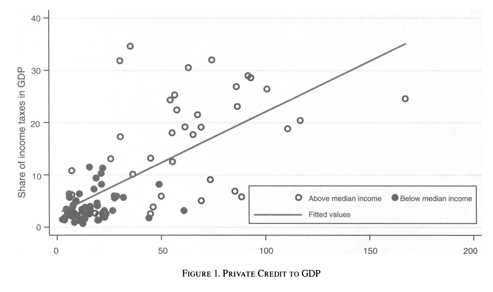
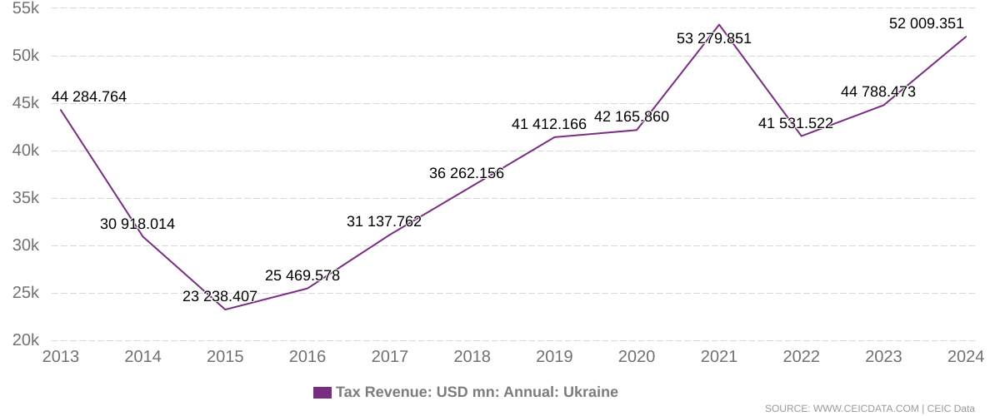

## Outline {visibility="hidden"}

```{r setup}
#| echo: false
#| message: false
library(tidyverse)
library(cowplot)
library(ggrepel)
```

Go back to Olson: think about the transition from roving to stationary banditry also means a transition (not necessarily exactly simultaneous) from theft to bargaining

"Bargaining" doesn't mean no coercion is involved --- sense of "quasi-voluntary compliance"

What are the *opportunities* and *constraints* on a ruler who wants to raise revenue?


## Recap

Last couple weeks --- basics of war and state development

- Tilly: war made the state and the state made war
- Abramson: contrary evidence for small states in Europe
- Thies: extension of argument to Latin America
- Dincecco and Wang: exit options and the China-Europe contrast

Now going to start drilling down into how war affects specific aspects of state development, starting with revenue


## Today's agenda

1. Why revenue matters to rulers
2. Revenue and the balance of bargaining power
   - What determines how much rulers can extract?
   - What determines how much subjects can demand in return?
3. How war shifts the revenue bargain


# Why does revenue matter?

## Why revenue matters to rulers

Levi: "Rulers maximize revenue to the state, but not as they please."

Why try to maximize revenue?

- Personal consumption
- Resources to attain political goals
- Resources to buy support and prevent defection
- Subjects might demand policies that cost money

## Revenue in a democratic context

{fig-align="center"}

## Roving and stationary bandits: Recap

Remember Olson's model of state development

1. State of nature --- anarchy

   - Total "self help," no protection or authority

   - All production subject to theft by roving bandits

   - Hence little incentive to produce

2. Establishment of stationary bandits

   - Eliminate roving bandits, monopolize violence in territory

   - [Repeated]{.underline} theft from same population

   - Don't steal everything today $\leadsto$ more to take tomorrow

   - Better for both the bandit and the victims

## Revenue and bargaining

How can a stationary bandit maximize their long-run income?

- Create conditions for stable investment and growth
- Defense against external and internal threats to security
- Enforcement of contracts among citizens
- Institutional limits on appropriation by the state (e.g. eminent domain)

Eventually taxation stops looking like **theft** and starts to look like **bargaining**

## Levi's argument

State revenue is determined by the **balance of bargaining power** between the ruler and the tax base

- Ruler's "price" is the amount of revenue they will extract
- Population's "price" is the value they'll get from the ruler --- good things done for them, or bad things prevented

. . .

What is bargaining power?

- "Outside option value"
- If we don't reach a deal, what's my next-best option, and how much worse off does that make me?

This balance is shaped by both economic and political forces

## Relative bargaining power of rulers

Sources of bargaining power --- when can the ruler get away without making concessions or providing value?

. . .

- Outside sources of revenue
  - Monarchy that holds lots of land
  - Modern-day petrostate where government controls oil
  - Corrupt government with control over foreign aid

. . .

- Highly effective coercion
  - Costly defiance for subjects $\leadsto$ more bargaining power for ruler
  - "Quasi-voluntary compliance": bargaining doesn't imply fairness

## Relative bargaining power of subjects

When can the population get value for the taxes they're paying?

. . .

- Attractive exit options (Dincecco and Wang)

. . .

- Diverse, commercial economy --- money not concentrated

. . .

- Organization for collective action
  - Usually very hard to mount large-scale resistance
  - But once it reaches that point, very hard to stop

## Revenue and state capacity

If a state is able to extract a high percentage of GDP as revenue, what does that tell us about the state?

. . .

Two possibilities (not mutually exclusive)

1. Voluntary compliance
   - State offers real value for the taxes it extracts
   - Population supplies the taxes for the state to achieve its aims

2. Coerced compliance
   - State can credibly threaten to punish those who withhold
   - Population lacks means or willingness to resist

. . .

Both of these indicate different dimensions of **high state capacity**

## Revenue and state capacity

{fig-align="center"}

# War and revenue

## War is a money maker

{fig-align="center"}

## War is a money maker {visibility="uncounted"}

{fig-align="center"}

## War is a money maker

Tax revenue in Ukraine:

{fig-align="center"}

(way bigger spike if you include foreign aid, of course)

## War and revenue bargaining

How does war affect relative bargaining power?

. . . 

- Increased demand for protection $\leadsto$ shifts toward ruler
  - Basically impossible for private market to defend against invaders
  - Clear value for the ruler to provide

. . .

- Fewer/worse exit options $\leadsto$ shifts toward ruler

. . .

- "Rally round the flag" $\leadsto$ shifts toward ruler
  - Diminished willingness to revolt

. . .

- Militarization of society
  - $\leadsto$ favors ruler in short run
  - longer run is more ambiguous!

## What we'll be looking for

How much does war raise the extractive capacity of states?

. . .

How persistent are these effects?

. . .

If rulers like revenue and war raises revenue, does that create perverse incentives?

# Wrapping up

## What we did today

1. Importance of revenue
   - Variety of uses for rulers
   - Indicator of state capacity

2. Revenue as bargaining between ruler and subjects
   - Ruler's power: outside revenue sources, coercive capacity
   - Subjects' power: exit options, diverse economy, collective action
   - Levi's "quasi-voluntary compliance" --- bargaining doesn't imply fairness

3. How war shifts the revenue bargain
   - Demand for protection, fewer exit options, rally-round-the-flag $\leadsto$ power shifts toward ruler

## To do for next time

Looking at more systematic evidence about war and state revenue

Reading: **Karaman and Pamuk 2013**

Other reminders:

- Tuesday, 2:00--3:30pm: My office hours
- Friday, 3:00--4:30pm: Seung Ho's office hours
- Friday night: **Project proposal due**
