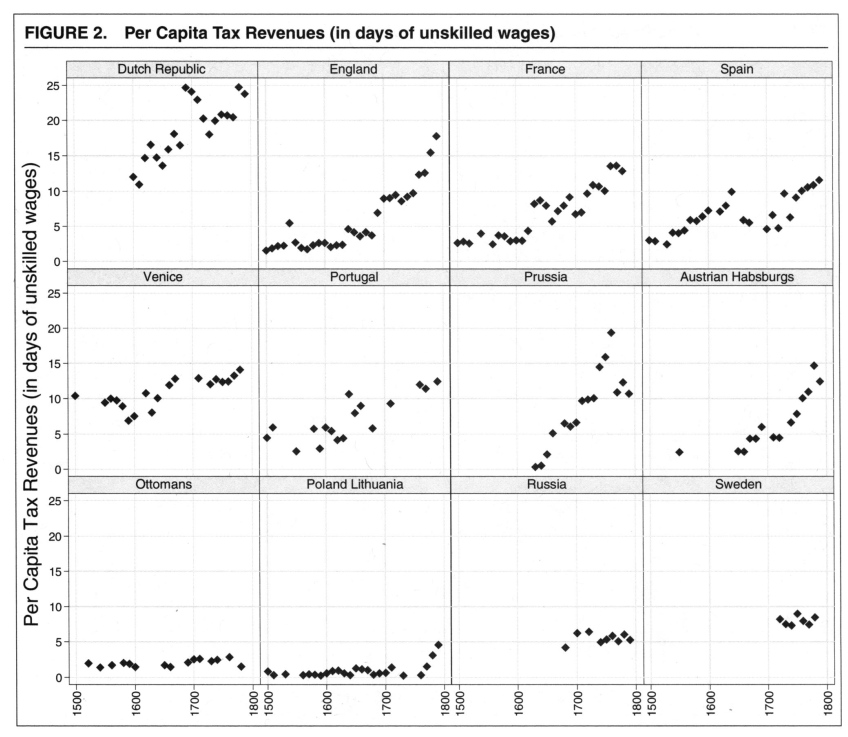
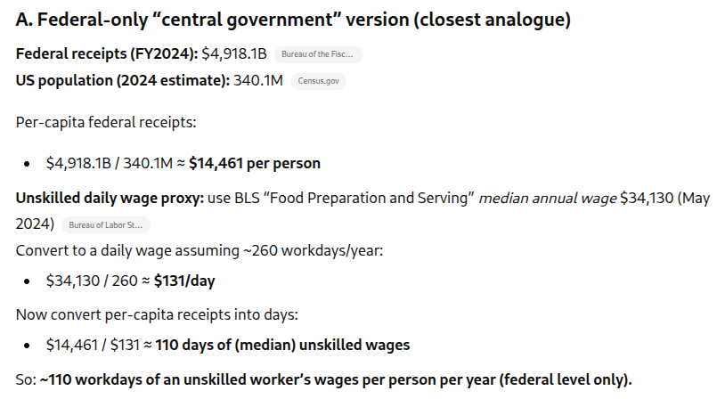
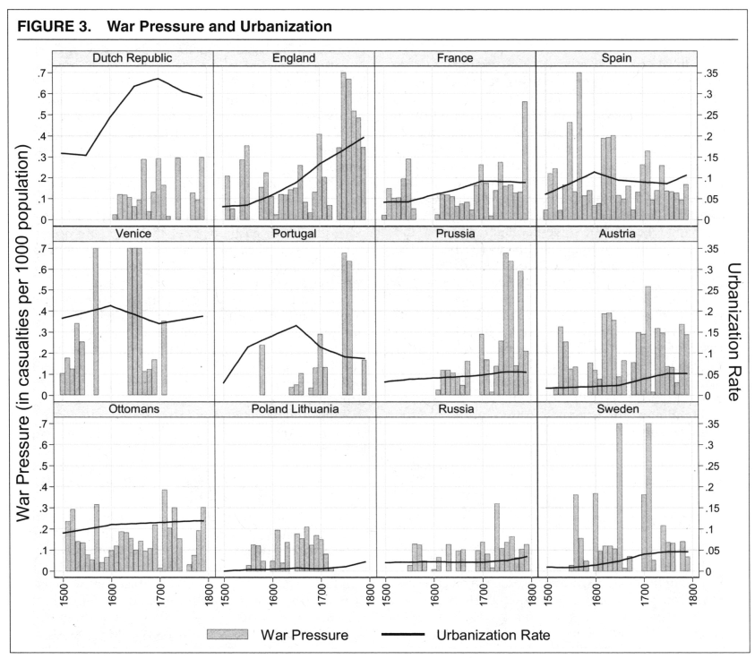
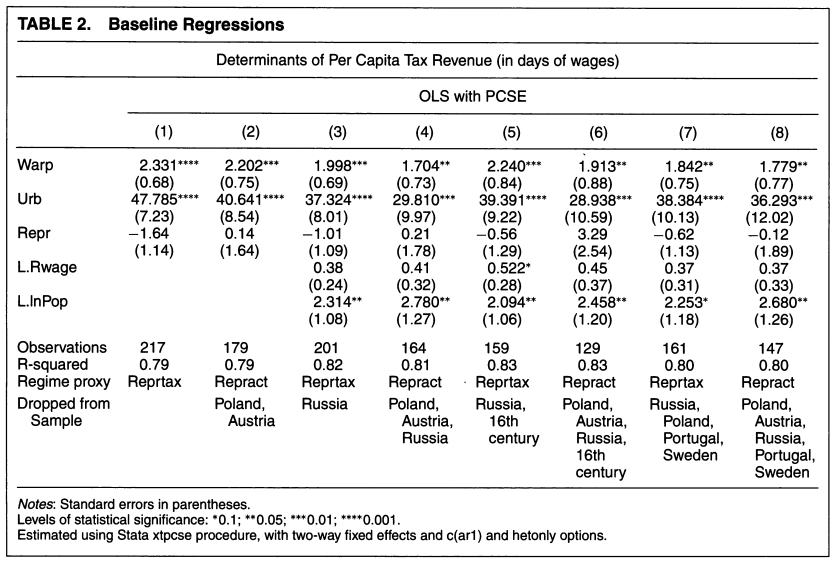
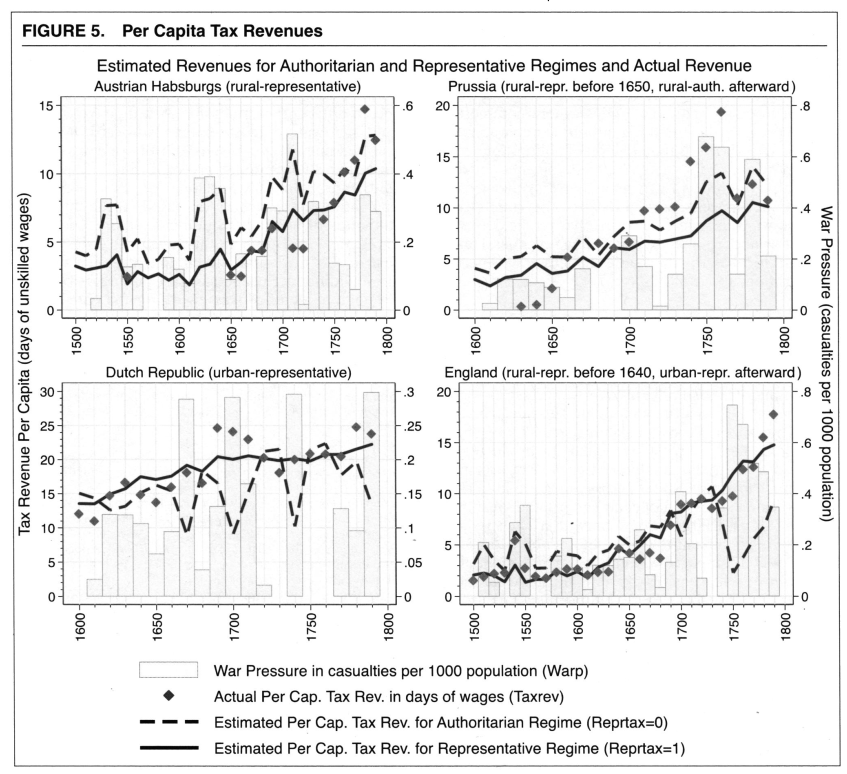

## Hypotheses

What are Karaman and Pamuk going to collect data on?

. . .

1. More intense war participation $\leadsto$ more fiscal capacity
   - Consistent with Tilly, Thies, Levi

. . .

2. More urbanized society $\leadsto$ more fiscal capacity
   - Consistent with Spruyt, Abramson

. . .

3. More representative government $\leadsto$ more fiscal capacity? or less?
   - "More" consistent(ish) with Dincecco and Wang
   - But also compelling reasons to believe "less"

. . .

4. **Interactions** --- each factor might alter the effects of others

## Data

**Dependent variable:** fiscal capacity

- Raw measures: total and per capita tax revenue by silver weight
- Preferred measure: per capita tax revenue, in days of unskilled labor
  - roughly, how many days would you have to work an unpleasant job in a city to pay off the average annual tax bill?

. . .

**Independent variables:**

- War intensity --- "apportioned" casualties per thousand
  - all casualties divided evenly across sides, to proxy for intensity
- Urbanization --- share of population living in cities w/ 10k+ residents
- Representation --- responsibility/frequency of a national assembly

## Differences in fiscal capacity

{fig-align="center"}

## Fiscal capacity: Present-day comparison

{fig-align="center"}

Important caveat for real-world impact: US taxes now [much]{.underline} more progressive than European state taxes in 1500--1800

## Differences in war intensity (and urbanization)

{fig-align="center"}

## The key correlations

{fig-align="center"}

War and urbanization correlated with higher revenues 
No consistent pattern with representation

## What's the deal with representation?

Karaman and Pamuk's basic premises:

- Representation enables elite coordination and cooperation
- Urban elites are favorable to central states, rural elites aren't

. . .

Leads them to expect *conditional* effects of war pressure

- urbanized, representative $\leadsto$ war makes the state
- rural, autocratic $\leadsto$ war also makes the state (diff reasons)
- war doesn't make state in urban/autocratic or rural/representative

. . .

(my take: insufficient data to make solid inferences about such a thin-sliced argument...)

## Urbanization, representation, and war: Nuances

{fig-align="center"}

# Wrapping up

## What we did today

1. Levi's theory of rulers and revenue
   - Rulers must compel or cooperate with elites to raise money
   - Relative bargaining power is key determinant of fiscal capacity
   - War (mostly) shifts that power toward the ruler

2. Karaman and Pamuk's statistical evidence
   - War pressure + urbanization increased fiscal capacity in Europe
   - Effects of representative institutions were ... complicated

## To do for next time

**Project proposal due Friday** at 11:59pm

Need help before then?

- Email me, <brenton.kenkel@gmail.com>
- Seungho's office hours, Friday 3:00--4:30pm, Commons 317

**For Monday** read Queralt 2019, "War, International Finance, and Fiscal Capacity in the Long Run"
