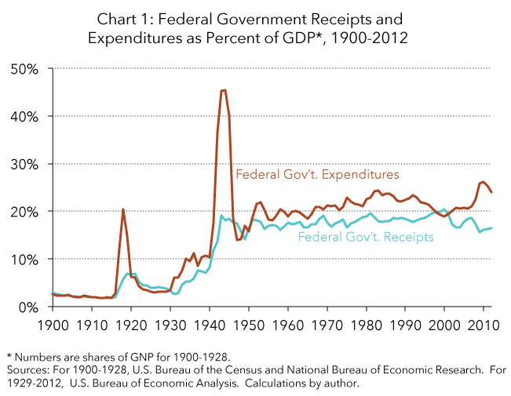
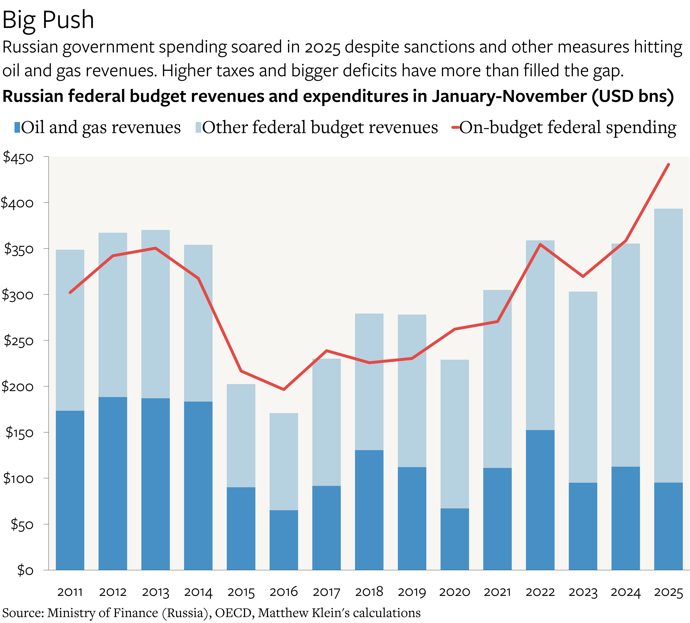
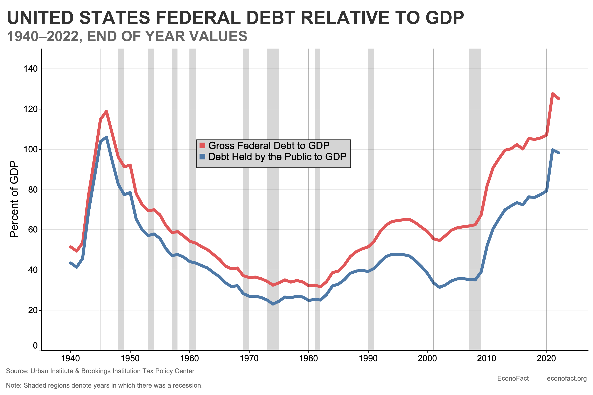
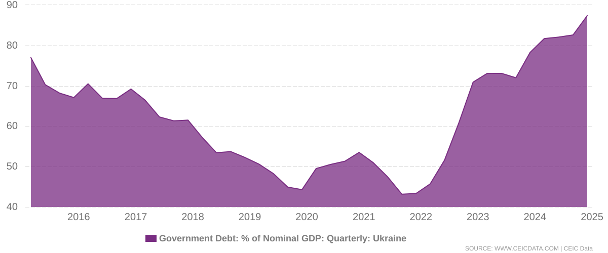
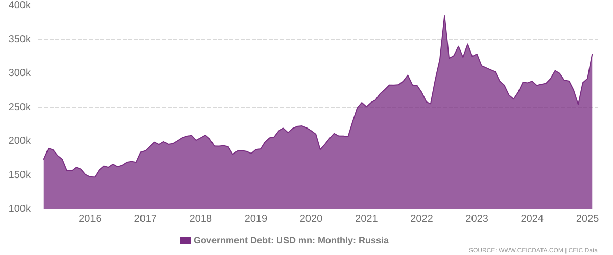
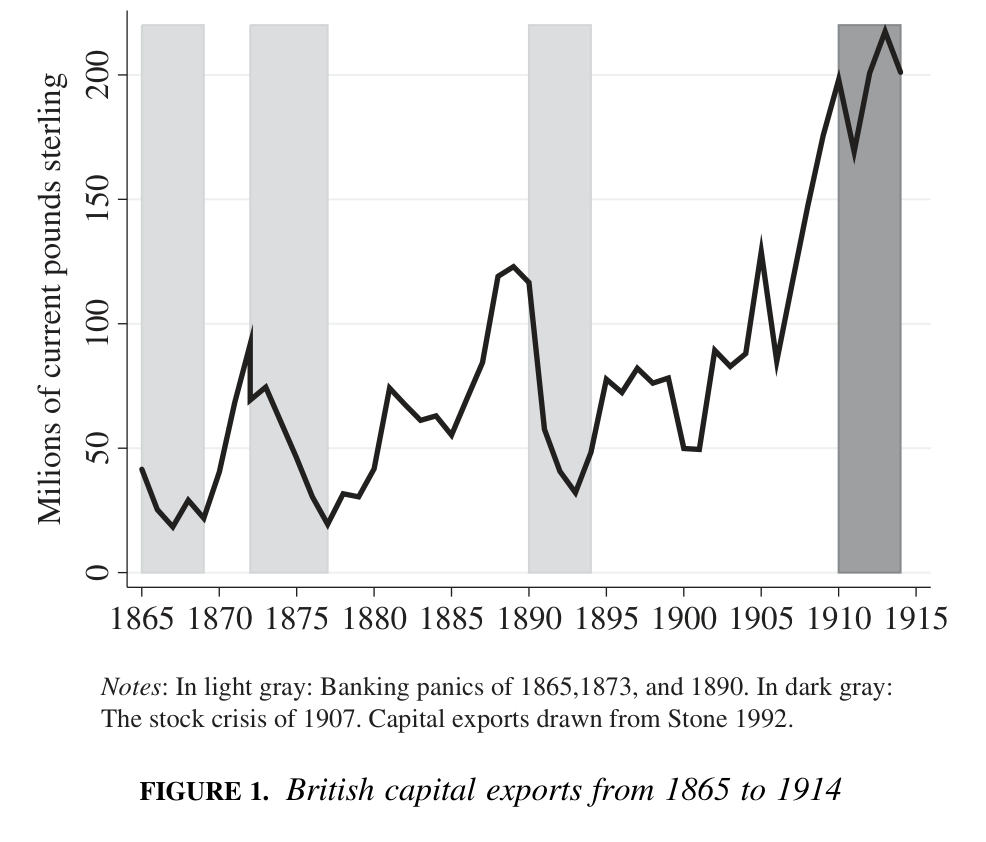
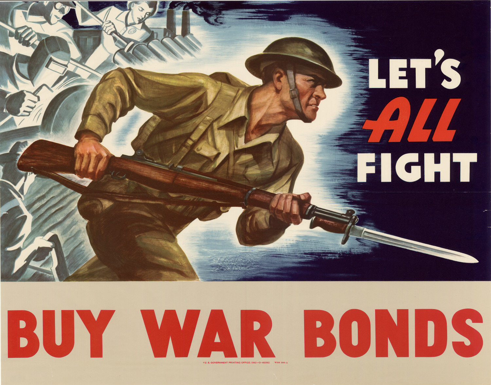
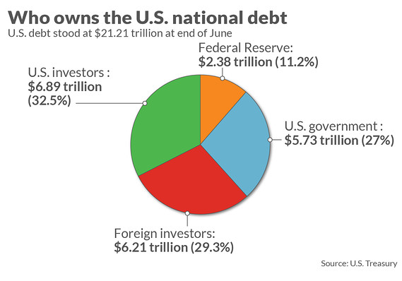
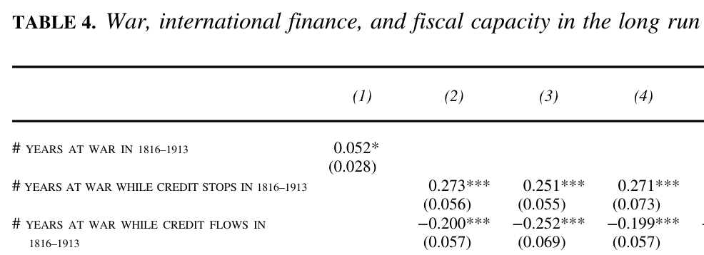
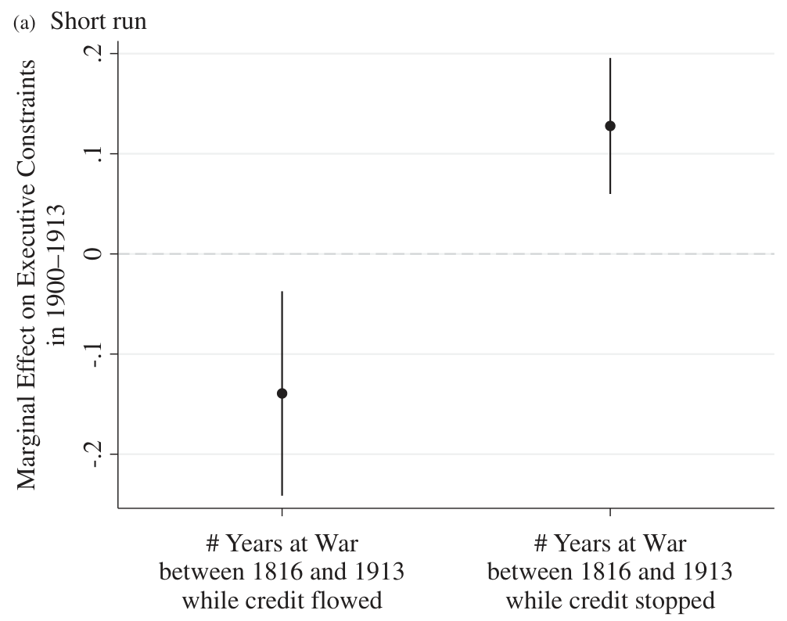

## Quarto setup {visibility="hidden"}

```{r setup}
#| echo: false
#| message: false
library(tidyverse)
library(cowplot)
library(ggrepel)
```

## Today's agenda

Revenue and war --- where we've been so far

- Levi: rulers want max revenue, but must bargain with elites
- War shifts bargaining power in favor of rulers (mostly)
  - War should increase revenue in short run
  - And long run too, via ratchet effect
- Karaman and Pamuk's stats: war raised fiscal capacity in Europe

Problem for this tidy story: what about when **foreign debt** pays for war?


# Debt and war: Theory

## War increases tax revenue...

{fig-align="center"}

## War increases tax revenue... {visibility="uncounted"}

{fig-align="center"}

## War increases tax revenue... {visibility="uncounted"}

{fig-align="center"}

## ...and war increases debt

{fig-align="center"}

## ...and war increases debt {visibility="uncounted"}

{fig-align="center"}

## ...and war increases debt {visibility="uncounted"}

{fig-align="center"}

## Who do states borrow from?

::: {.columns}
:::: {.column}
{height="250px"}
::::
:::: {.column}
{height="250px"}
::::
::: 

::: {.columns}
:::: {.column}
{height="250px"}
::::
:::: {.column}
{height="250px"}
::::
:::

## Advantages of debt finance

Why fund a war with debt instead of taxes?

. . .

**The Klarna logic.**

- Why pay now when you can pay later?
- War threat $\leadsto$ might be dead tomorrow $\leadsto$ shorter time horizon

. . .

**Loosening the bargaining constraints.**

- Domestic constituencies demand political concessions
  - Already squeezed by war: conscription, inflation, trade restrictions...
- Banks just demand future payment with interest

## Debt finance, war, and statebuilding

Standard logic of war and revenue

- War $\leadsto$ greater revenue need, less elite bargaining power
- Efficient tax collection systems and successful elite bargains develop
- These persist even after war (ratchet effect)

How does debt finance break this chain?

::: {.incremental}
- Less incentive to cultivate/measure tax base
- Less incentive to grow the economy in the long run
- No need to share power with elites and reach long-run bargains
:::

. . .

Hypothesis: **War makes the state only when funded by taxes, not debt**

## Debt finance and war: counterpoints

Hypothesis: **War makes the state only when funded by taxes, not debt**

...but there are some reasons for skepticism

. . .

- Ricardian equivalence: debt's gotta be paid, so taxes will be raised sometime
- Political logic: if debt breaks the state, shouldn't rulers use taxes?

. . .

Counter-counterpoints:

- Debt sometimes defaulted or "paid" w/o taxes (oil, land, monopolies)
- Short time horizons → repayment might be someone else's problem
- Did rulers understand that war made the state?

## Why not *always* pay for war with debt?

If war loans solve political problems, why do we ever see rulers raise taxes instead of taking out debt?

. . .

**Lack of credit access --- endogenous.**

- Bad war prospects, prior defaults $\leadsto$ high market interest
- At some margin, better to eat the political costs now
- Eventually, lenders simply won't loan to bad enough credit risks

. . .

**Lack of credit access --- exogenous.**

- Financial crises and stock crashes dry up supply of capital
- Particularly in 1800s, when Britain was >50% of foreign capital market

# Debt and war: Evidence

## How to study the effects of war debt

Causal hypotheses:

- War paid for by taxes $\leadsto$ high long-run fiscal capacity
- War paid for with debt $\leadsto$ no/negative change

. . .

Suggests a **tempting but problematic** method of analysis

- Count up taxes each state raised for war
- Count up debts each state incurred for war
- See how well each predicts future fiscal capacity

Why would we go wrong doing it this way?

## The endogeneity problem

Actual debt incurred for war represents multiple things

- Exogenous credit supply --- how much capital is out there to lend
- Endogenous credit supply --- how risky is this borrower?
- How well the war is going --- how much damage has the domestic economy taken?

. . .

Endogenous credit risk + war performance are **confounding variables**

- Could directly impact long-run capacity, aside from effects on debt finance
- Hard to trace differences in long-run outcomes to the *choice of instrument* rather than the *competency and reliability of the government*

## The endogeneity problem

```{r endogeneity-scatter}
#| echo: false
#| fig-width: 10
#| fig-height: 6
endogeneity <- read_csv("endogeneity_data.csv", show_col_types = FALSE)

ggplot(endogeneity, aes(x = bond_yield, y = tax_gdp)) +
  geom_point() +
  geom_text_repel(aes(label = country), size = 4, seed = 42) +
  geom_smooth(method = "lm") +
  labs(
    x = "10-Year Sovereign Bond Yield (%)",
    y = "Tax Revenue (% of GDP)",
    title = "Countries that can tax more can also borrow more easily",
    subtitle = "Bond yields from countryeconomy.com, tax revenue from OECD, assembled by Claude Code"
  ) +
  theme_cowplot()
```

## Queralt's solution

{fig-align="center"}

Britain was the "world's banker" between Napoleonic Wars and WWI

Localized shocks to British markets $\leadsto$ exogenous contraction of credit supply

## Research design

**Dependent variables:** long-run fiscal capacity

- Income taxation as proportion of GDP, 1995--2005
- Tax administration staffing per capita
- Value-added taxes

**Independent variables:**

- Years at war, 1816--1913, when British capital flow "stopped"
- Years at war, 1816--1913, when British capital flowed normally

**Expectation:**
War participation only builds the state in periods of credit stops

## Statistical findings

{fig-align="center"}

## Why does war-without-credit make the state?

Apparent mechanism: Forcing the ruler to share power

{fig-align="center"}

# Wrapping up

## What we did today

1. Debt as an alternative to taxes for war finance
   - Advantages: pay later, avoid political concessions to elites
   - But: breaks the war $\leadsto$ state chain
   - Why not always use debt? Credit is limited by risk + market shocks

2. Queralt's evidence on debt, war, and statebuilding
   - British capital market shocks as exogenous credit supply variation
   - Finding: war builds the state only when credit is unavailable
   - Mechanism: forced power-sharing with domestic elites

From here, we'll dig deeper into that "forced power-sharing" --- look at effects of war on **parliaments**

## To do for next time

Read Kenkel and Paine 2023, "A Theory of External Wars and European Parliaments"

- Do external threats make rulers more likely to share power with parliaments?
- We say: sometimes yes, sometimes no
- Threats make ruler more **willing** to share... but affect elite incentives in countervailing ways
