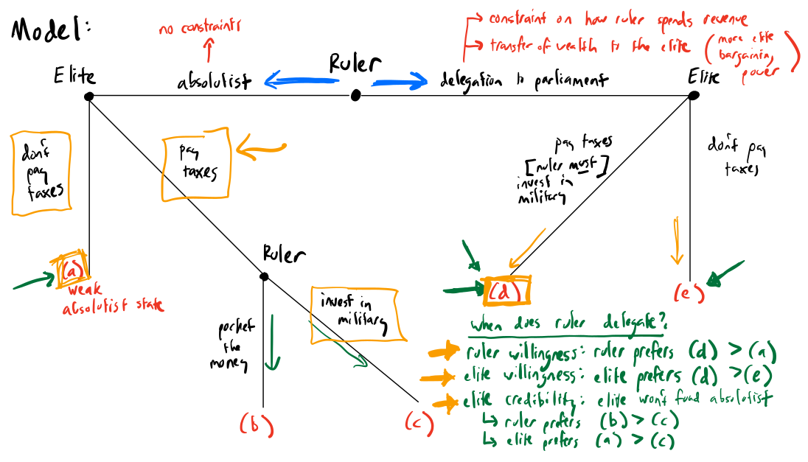

## FYI

In this class, we covered Kenkel and Paine's *IO* article "A Theory of External Wars and European Parliaments."

Instead of giving a slide presentation, I walked through a sketch of our theoretical model --- the next slide contains the final product of that sketch.

##

{fig-align="center"}
