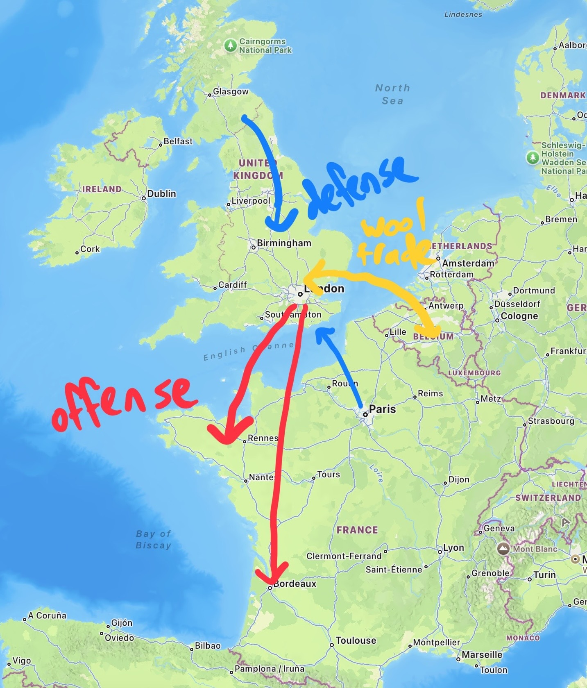
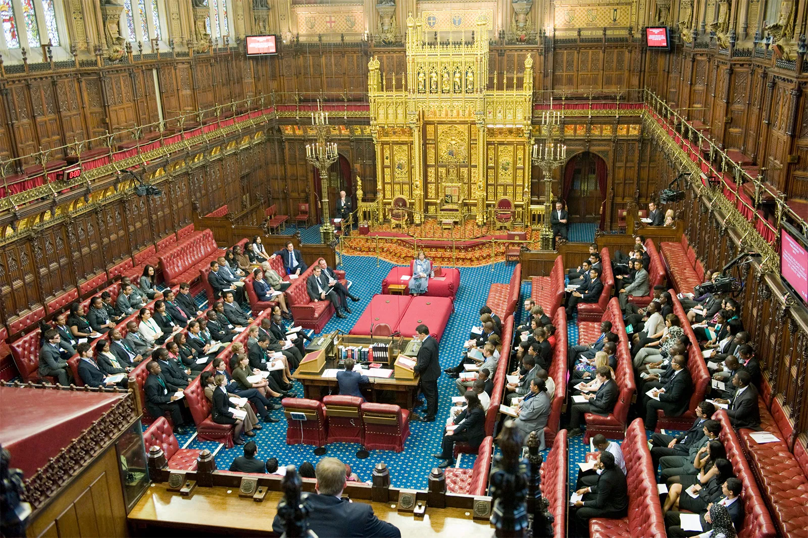
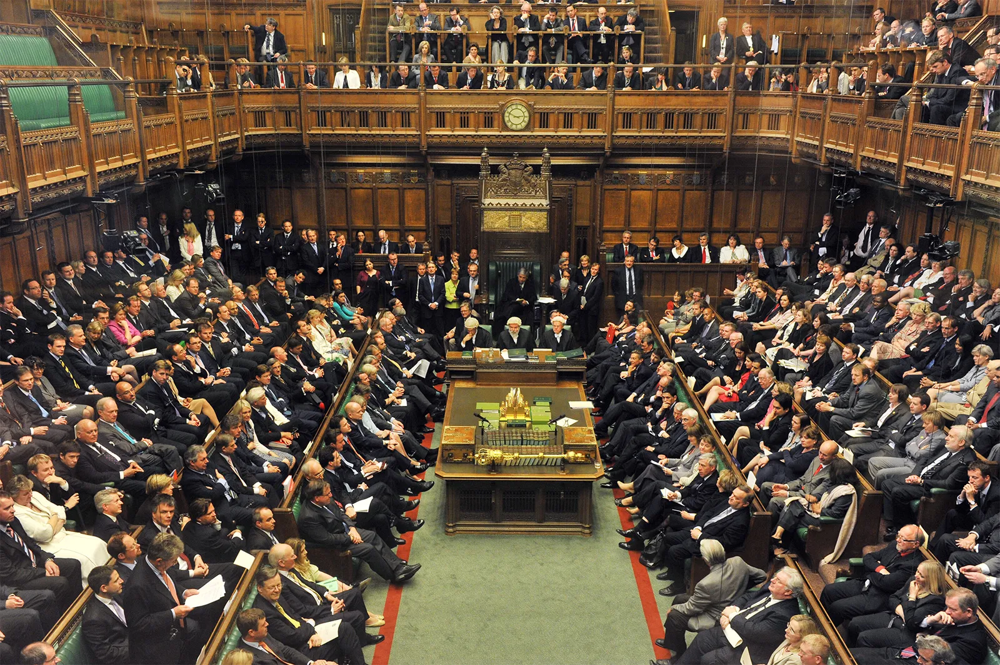
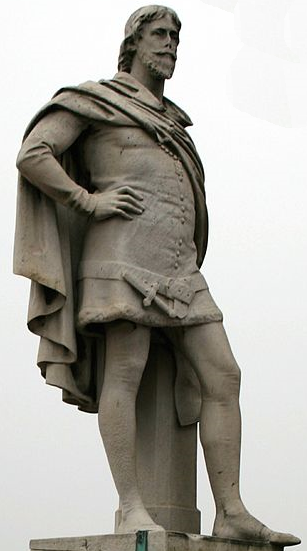
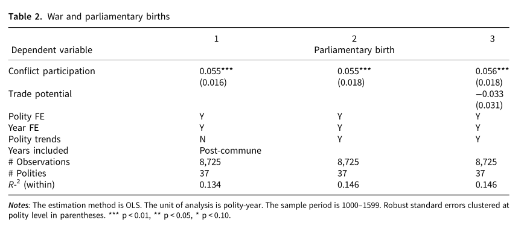

```{r}
#| echo: false
#| message: false
library(tidyverse)
library(cowplot)
library(ggrepel)

cdo <- read_csv("cdo_polity_data.csv", show_col_types = FALSE)
```

## Recap

**Last time:** Kenkel and Paine on delegation to parliament

- Key conditions for a ruler to delegate control of finances
  - Ruler willingness: Would ruler rather delegate + get taxes than stay absolute + get nothing?
  - Elite willingness: If ruler delegates, will elite actually pay?
  - Elite credibility: If ruler *doesn't* delegate, will elite refuse to pay?

- External threats always enhance ruler willingness...

- ...but can kill willingness for merchant elites, or credibility for landed elites

## Today's agenda

Cox, Dincecco, and Onorato on parliamentary formation

1. Key distinctions between noble councils and parliaments
2. The historical puzzle: Why did parliaments arise in Europe but not Asia?
3. Statistical evidence on war and parliament formation

# Why convene a parliament?

## The ruler's problem

Ruler wants money to conduct foreign policy

- Defend the realm from external threats
- Expand the realm through territorial conquest
- ...or both

Needs to get the money from the society's elite

. . .

This poses both **political** and **logistical** problems

- Political: elites (usually) won't just hand over money for nothing
- Logistical (especially in 19th century and earlier)
  - They're spread out all over the country
  - How can you strike a deal with one without angering some other?

## England in the 1330s: Foreign policy

::: {.columns}
:::: {.column}
{fig-align="center"}
::::
:::: {.column}
Posed threat to Brittany + Gascony

Faced threat from Scotland + France

Main finance sources

- Florentine bankers
- Wool exports to Flanders

Crown tried to directly monopolize the wool trade, but this was a fiasco
::::
:::

## Getting the powerful people together

One way to simplify bargaining --- get the important elites all in one place

Take a minute to chat: what are the main **benefits** and **costs** to a ruler from bringing together all the elites who could put up the money for war?

## Noble councils versus parliaments

Key distinction in Cox, Dincecco, & Onorato (CD&O)

- **Noble council:** collection of landed, titled elites
- **Parliament:** expansion to include non-noble elites --- "burghers" whose money came from commerce and trade

. . .

::: {.columns}
:::: {.column}
{fig-align="center"}
::::
:::: {.column}
{fig-align="center"}
::::
:::

## Who's a commoner? (Hint: not all that "common")

::: {.columns}
:::: {.column}
{fig-align="center"}
::::
:::: {.column}
Prototypical example: **William de la Pole**, 1290s--1366

Humble origins, parentage not conclusively known

Major wool exporter from 1320s onward, sat in Parliament in 1330s

Increasingly important lender to Edward III for wars with Scotland and France

Lent the incomprehensible sum of £100,000 to the crown in 1338--1339
::::
::: 

## Necessary conditions to go from council to parliament

Why would a self-respecting ruler expand the noble council to include mere commoners?

. . .

**1\. The ruler needs money.**
Typically: the realm is under threat, or the ruler wants to go bully someone else.

. . .

**2\. (Some) commoners have money.**
There's enough of an urban burgher/merchant class that not all of the realm's money is tied up in land.

. . .

**3\. There's no other way to get their money.**
No existing tax bureaucracy under the ruler's thumb---have to get the commoners to cooperate.

# Communes, war, and parliament: Evidence

## The historical puzzle

Reason to believe "war creates parliament" --- ruler will only give up power when they acutely need cash

Yet historical evidence indicates it's not so simple

- War was common throughout medieval Europe and Asia
- Yet urban elites were only given parliamentary representation in Europe

. . .

Does this mean war doesn't create parliament?

**CD&O's answer:** War does create parliament, but only under the right background conditions

## CD&O's hypotheses

**1\. No communes, no parliaments.**

- Communal revolution: urban revolts against landed elites, resulting in self-governance for many towns
- Occurred in Europe, not in China or elsewhere to the east
- Key prediction: no establishment of parliament until after establishment of communes

. . .

**2\. After communes, war makes parliaments.**

- War pressure drives need for funds --- we've already discussed why
- Communal revolution → urban elites have money → form parliament to bargain with them over taxation

## CD&O's data

**Sample** --- early states in Europe

- Sovereign polity in Latin or Orthodox Christian sphere as of 1200
- 5,000+ square kilometers (at least the size of Delaware, basically)
- Survived at least 100 years

**Independent variables**

- Century of earliest commune formation
- Annual number of military conflicts participated in

**Dependent variable:** year of parliament formation

## No communes, no parliaments

```{r}
#| echo: false
#| cache: true
#| fig-width: 10
#| fig-height: 6
ggplot(cdo, aes(x = century_firstcommune, y = parl_year)) +
  geom_smooth(method = "lm", color = "red", se = FALSE) +
  geom_point(shape = 1, size = 2) +
  geom_text_repel(aes(label = polity), size = 4, seed = 42) +
  scale_x_continuous(
    breaks = 11:14,
    labels = c("11th", "12th", "13th", "14th")
  ) +
  scale_y_continuous(breaks = seq(1150, 1600, 50)) +
  coord_cartesian(xlim = c(10.5, 14.5), ylim = c(1130, 1610)) +
  labs(
    x = "Communal revolution (century)",
    y = "Parliamentary birth (year)"
  ) +
  theme_cowplot()
```

## War makes parliaments --- inside the "window"

```{r}
#| echo: false
#| cache: true
#| fig-width: 10
#| fig-height: 6
ggplot(cdo, aes(x = avg_conflicts_50yr_post_commune, y = parl_year)) +
  geom_smooth(method = "lm", color = "red", se = FALSE) +
  geom_point(shape = 1, size = 2) +
  geom_text_repel(aes(label = polity), size = 4, seed = 42) +
  labs(
    x = "Avg. annual conflicts in 50 years after communal revolution",
    y = "Parliamentary birth (year)"
  ) +
  theme_cowplot()
```

## War makes parliaments --- inside the "window"

{fig-align="center"}


# Wrapping up

## What we did today

1. Noble councils vs. parliaments
   - Councils = landed nobles; parliaments = expansion to include commercial elites (burghers)
   - Three necessary conditions: ruler needs money, commoners have money, no existing way to extract it

2. CD&O's theory: war creates parliaments, but only under the right conditions
   - Communal revolution $\leadsto$ autonomous urban elites with wealth outside the land
   - No communes, no parliaments --- Europe had them, Asia didn't

3. Evidence from European polities
   - Earlier commune formation $\leadsto$ earlier parliament formation
   - More war after communes $\leadsto$ earlier parliament formation

## To do for next time

**Next week** --- spring break! woo!

**Monday 3/16** --- read Acemoglu and Robinson 2000, "Why Did the West Extend the Franchise?"

**Friday 3/20** --- first draft of research paper due
