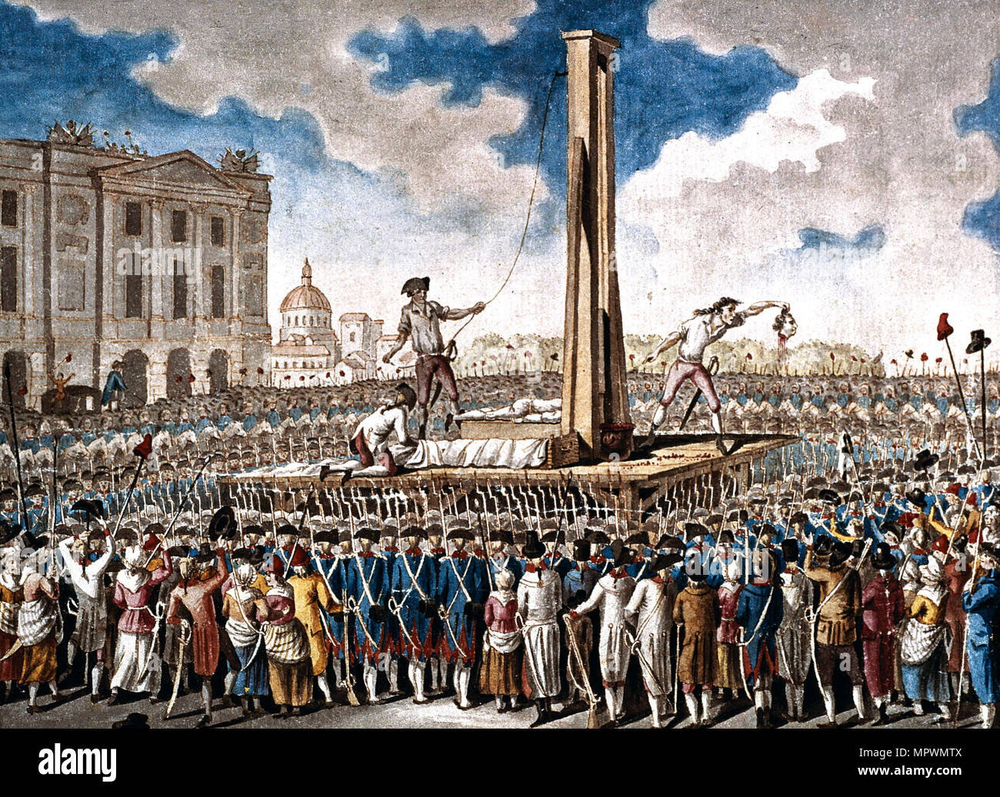
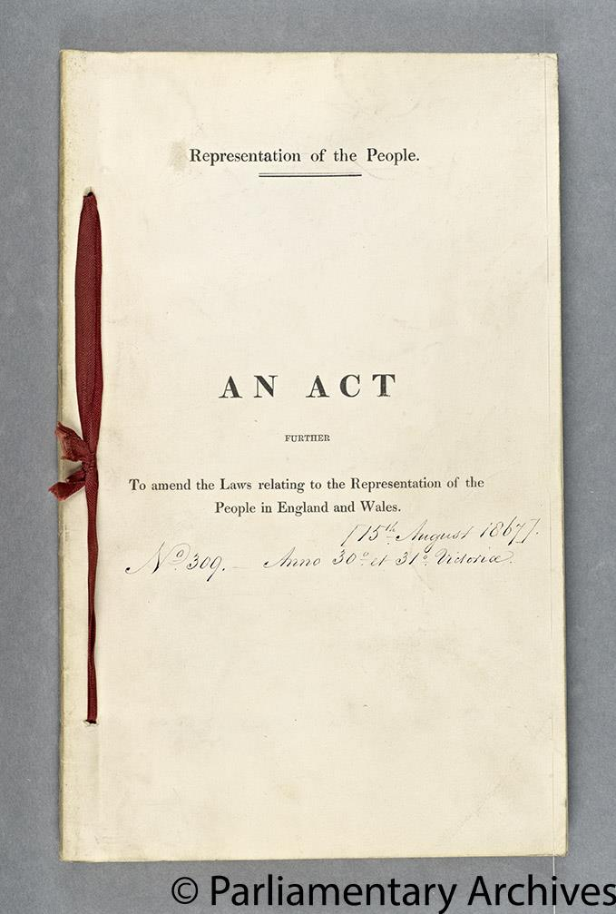
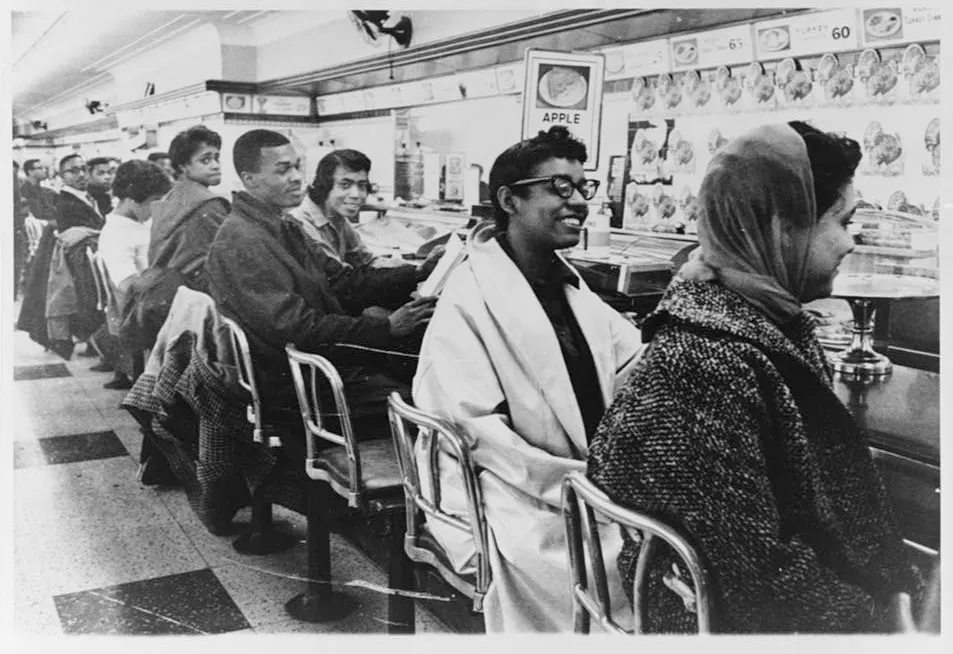
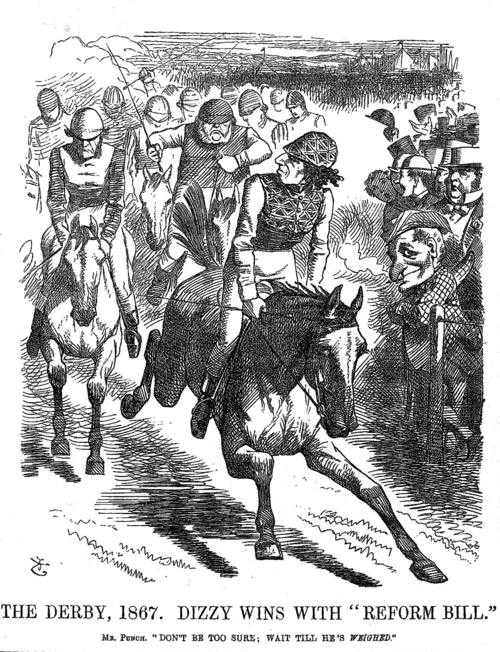
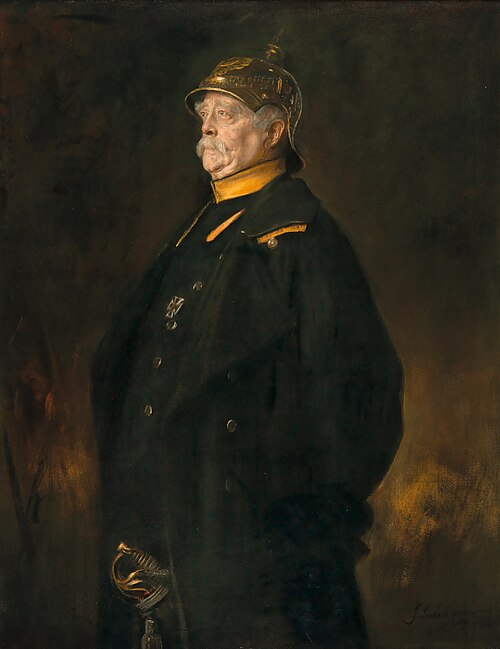

## Setup {visibility="hidden"}

```{r}
#| label: setup
#| echo: false
#| message: false

library(tidyverse)
library(countrycode)
```

```{r}
#| label: democracy-data
#| echo: false
#| message: false
#| warning: false
#| cache: true

library(vdemdata)
library(democracyData)
data("gwf_autocratic")

# V-Dem 2024: electoral and liberal democracies
democracies <- vdem |>
  filter(year == 2024, v2x_regime >= 2) |>
  select(iso3 = country_text_id, COWcode, v2x_regime)

# GWF: last autocratic regime per country
last_regime <- gwf_autocratic |>
  group_by(gwf_cowcode) |>
  slice_max(year) |>
  ungroup() |>
  select(gwf_cowcode, gwf_fail, gwf_fail_type)

# Join: flag current democracies whose last autocratic regime
# fell to popular uprising (GWF fail_type == 4)
demo_status <- democracies |>
  left_join(last_regime, by = c("COWcode" = "gwf_cowcode")) |>
  transmute(
    iso3,
    is_democracy = TRUE,
    revolt = coalesce(gwf_fail == 1 & gwf_fail_type == 4, FALSE)
  )

# Manual corrections:
# - Czechia & Slovakia: Velvet Revolution 1989 coded under Czechoslovakia (COW 315),
#   but successor states have different COW codes (316, 317) so the join misses them
# - Armenia: 2018 Velvet Revolution is post-GWF data (ends 2010)
# - Peru: GWF codes as "insiders change rules" but Fujimori was forced out by
#   mass protests (March of the Four Suyos) and fled the country
demo_status <- demo_status |>
  mutate(revolt = if_else(iso3 %in% c("CZE", "SVK", "ARM", "PER"), TRUE, revolt))

# Crosswalk: map_data region names -> ISO3
map_regions <- tibble(region = unique(map_data("world")$region)) |>
  mutate(iso3 = countrycode(region, "country.name", "iso3c", warn = FALSE))

# One row per map region
country_data <- map_regions |>
  left_join(demo_status, by = "iso3") |>
  mutate(
    is_democracy = coalesce(is_democracy, FALSE),
    revolt = coalesce(revolt, FALSE)
  )
```

## "Quiz" feedback results

- Positive reactions
  - Reading quizzes as accountability mechanism
  - Organization and course website
  - Most didn't mention the project, but those who did were positive
- Mixed reactions
  - Some feel like we're racing through topics, others feel like we're lingering too long
  - Some like the lectures, others think they adhere too close to the readings
- Negative reactions
  - Lot of apprehension about the midterm, especially question complexity and the essay
  - Too little in-class interaction

## Recap

**Before spring break:** war and parliaments

- War $\leadsto$ ruler needs money $\leadsto$ must bargain with elites to get it

Kenkel and Paine on how external threats shape conditions for bargaining

- Ruler willingness: increases with external threat
- Elite willingness: harmed by external threat if wealth is mobile
- Elite credibility: harmed by external threat if wealth is immobile

Cox, Dincecco, Onorato on why parliaments emerged in the first place

- "Window of opportunity": urban wealth exists, tax bureaucracy doesn't
- Find that war $\leadsto$ earlier parliament under these conditions

## Today's agenda

1. The basic obstacle to democratization
2. Two paths to democracy: revolt vs. elite concessions
3. Acemoglu and Robinson's theory of franchise expansion
   - Why permanent institutional change instead of temporary policy concessions?
   - The commitment problem logic
4. Connecting democratization back to war

# Democratization

## The basic obstacle to democratization

Most people are not very wealthy

Political elites in non-democratic societies are (typically) very wealthy

If you let the people take power, they might use it to take your wealth

## Two paths to democracy

1\. Popular revolt --- remove tyranny by force

{fig-align="center"}

example: French Revolution

## Two paths to democracy

::: {.columns}
:::: {.column}
2\. Elite concessions --- extend political rights without open revolt

example: franchise expansions in Britain
::::
:::: {.column}
{fig-align="center" width="80%"}
::::
:::

## Current democracies

```{r}
#| label: map-democracies
#| echo: false
#| fig-width: 10
#| fig-height: 5.5

map_data("world") |>
  filter(region != "Antarctica") |>
  left_join(country_data, by = "region") |>
  ggplot(aes(long, lat, group = group)) +
  geom_polygon(aes(fill = is_democracy), color = "white", linewidth = 0.1) +
  scale_fill_manual(
    values = c("TRUE" = "#2166AC", "FALSE" = "#E0E0E0"),
    guide = "none"
  ) +
  coord_fixed(1.3, ylim = c(-60, 85)) +
  theme_void() +
  labs(caption = "Source: V-Dem v15 (2024), regime type ≥ electoral democracy")
```

## Democracies established through open revolt

```{r}
#| label: map-revolt
#| echo: false
#| fig-width: 10
#| fig-height: 5.5

map_data("world") |>
  filter(region != "Antarctica") |>
  left_join(country_data, by = "region") |>
  mutate(
    fill = case_when(
      revolt ~ "Popular revolt",
      is_democracy ~ "Other democracy",
      TRUE ~ "Non-democracy"
    )
  ) |>
  ggplot(aes(long, lat, group = group)) +
  geom_polygon(aes(fill = fill), color = "white", linewidth = 0.1) +
  scale_fill_manual(
    values = c("Popular revolt" = "#B2182B", "Other democracy" = "#A6C8E4", "Non-democracy" = "#E0E0E0"),
    guide = "none"
  ) +
  coord_fixed(1.3, ylim = c(-60, 85)) +
  theme_void() +
  labs(caption = "Source: Geddes, Wright & Frantz (+ manual additions) — last autocratic regime fell to popular uprising")
```

## Motivations for franchise expansion

No outright uprising does not mean public pressure was unimportant

Franchise expansion doesn't happen out of the goodness of elites' hearts

Example: USA civil rights movement

{fig-align="center"}

## Acemoglu and Robinson: key stylized facts

Typical path to democracy is elites giving up power, not being overthrown

. . .

...but this happens in the shadow of revolutionary pressure

. . .

Franchise expansion tends to occur when inequality has risen

. . .

...and inequality starts declining afterward

. . .

**A&R's task:** come up with a theory that explains all these patterns

## The key decision point for the elite

::: {.callout-note title="Discussion topic"}
Put yourself in the position of a wealthy political insider

Popular pressure is building, and you have two options to cool it:

1. Enact a redistributive policy (welfare, pension, health care, etc)
2. Alter the political system by expanding voting rights

What political/economic conditions would lead you to choose franchise expansion over a direct policy concession?
:::

## Acemoglu and Robinson's theory

Premises

1. Policies are **temporary**, while franchise expansion is (more) **permanent**
2. The threat of mass revolt is only active **on occasion**
   - collective action problems, preventive repression, etc.

. . .

Conclusions

- All else equal, elite prefers to placate masses with temporary concessions
- Sometimes, [no]{.underline} temporary concession can be enough to forestall revolt
  - Revolt threat infrequent --- now or never
  - High inequality --- stakes too big to back down
- Temporary concession insufficient + threat active $\leadsto$ [franchise expansion]{.alert}

## The commitment problem logic

Elites' first best: Never share any power

Elites' second best: Give away the minimum amount to prevent revolt

Instead of expanding franchise, why not promise future redistribution?

. . .

**Commitment problem** for this promise (aka time inconsistency)

- When facing revolt threat, elite *would* make this promise
- ...but no reason to keep adhering once the threat dissipates

. . .

::: {.callout-note title="Discussion topic"}
Are there long-term commitment devices besides franchise extension that elites could use to avoid revolt?
:::

## The British example

::: {.columns}
:::: {.column}
{fig-align="center" width="90%"}
::::
:::: {.column}
**1832, 1867, 1884.**

- Unusual rioting in early 1800s
- Reforms relaxed property reqs, electorate from 400k to 5.5m
- Earl Grey, 1831: "The Principal of my reform is to prevent the necessity of revolution"

**1918.** Universal male suffrage (lower age for veterans) and limited female suffrage.

**1928.** Universal female suffrage.
::::
:::

## The German counterexample

::: {.columns}
:::: {.column}
Germany also faced unrest in 1800s, but didn't democratize

Yet Germany under Bismarck also had an unusually well developed welfare state for the 1800s (pensions, health care)

**A&R's claim:** well organized labor movement in Germany $\leadsto$ frequent mass threat $\leadsto$ credibility of promises of ongoing redistribution
::::
:::: {.column}
{fig-align="center" width="80%"}
::::
:::

## Democratization and war

Key variables in A&R's theory:

- Frequency of mass organization that could threaten elites
- Credibility of mass revolt threat (costliness, likelihood of success)
- Wealth gap between elites and masses

::: {.callout-note title="Discussion topic"}
How would you expect each of these to be affected when war begins?
What about when a war has just ended?
:::


# Wrapping up

## What we did today

1. The basic obstacle to democratization
   - Elites fear redistribution if masses gain political power
   - Two paths: popular revolt (rare) vs. elite concessions (typical)

2. Acemoglu and Robinson's theory
   - Policies are temporary, franchise expansion is permanent
   - High inequality + infrequent revolt threat $\leadsto$ temporary concessions aren't enough
   - Commitment problem: promises of future redistribution aren't credible
   - Britain (concessions under threat) vs. Germany (welfare state with frequent organized labor)

3. Democratization and war
   - War affects mass organization, revolt credibility, and inequality --- all key variables in A&R

## The rest of the week

**Tuesday, 2:00--3:30pm.** My office hours, Commons 326.

**Wednesday.** Read Przeworski 2009, "Conquered or Granted?"

**Friday, 3:00--4:30pm.** Seungho's office hours, Commons 3rd floor TA office.

**Friday, 11:59pm.** First draft of research paper due.
