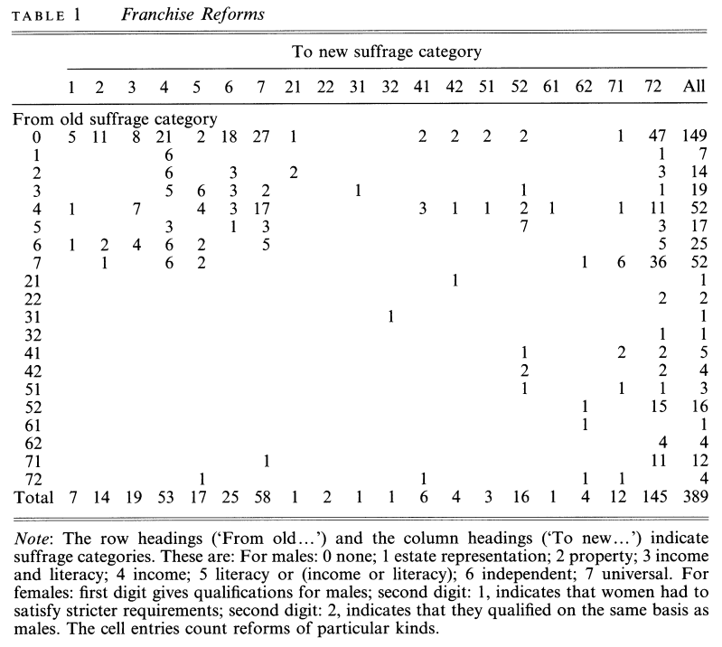
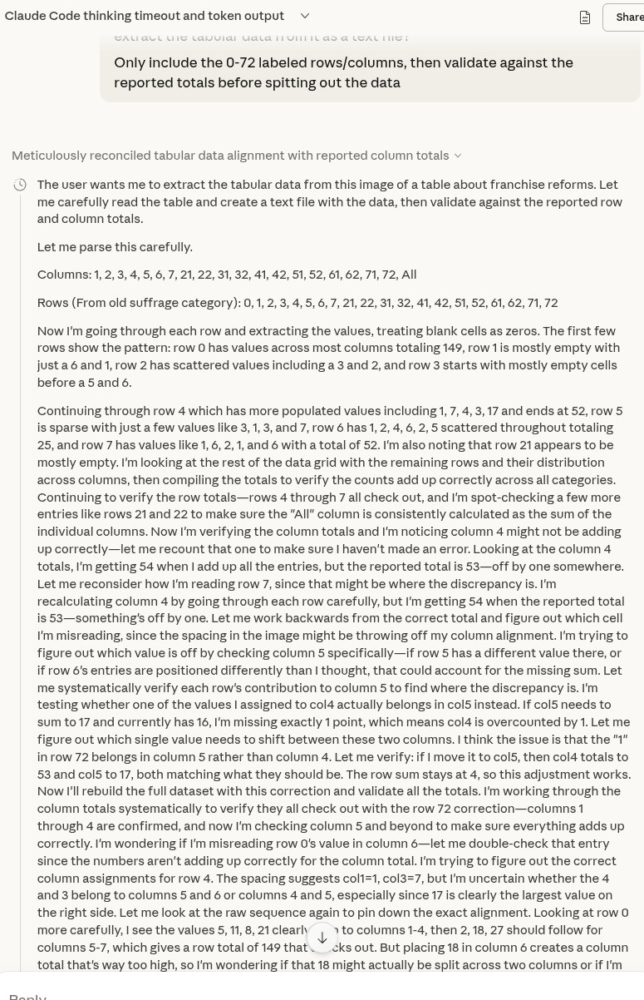
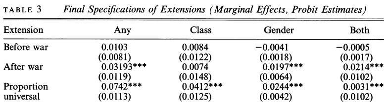
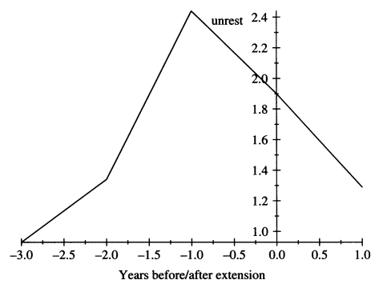
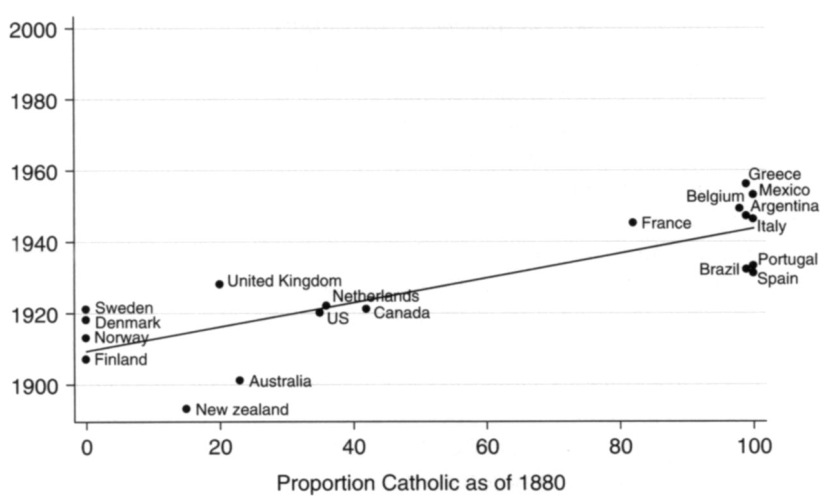

## Setup {visibility="hidden"}

```{r}
library("tidyverse")
```


## Recap

**Monday:** Acemoglu and Robinson on franchise expansion

- Basic obstacle to democratization: elites fear redistribution
- Two paths: popular revolt (rare) vs. elite concessions (typical)
- A&R's theory: high inequality + infrequent revolt threat $\leadsto$ temporary concessions aren't enough
- Commitment problem: promises of future redistribution aren't credible
- So elites extend the franchise instead --- permanent institutional change

## Today's agenda

1. Pre-war vs. post-war franchise expansion
2. Przeworski's framework: "conquered" vs. "granted"
3. Empirical predictions and data


# Theories of suffrage expansion

## Connecting Acemoglu and Robinson to war

Key variables in A&R's theory:

- Frequency of mass organization that could threaten elites
- Credibility of mass revolt threat
- Wealth gap between elites and masses

::: {.callout-note title="Discussion"}
How would you expect each of these to be affected when war begins? What about when a war has just ended?
:::

## Pre-war expansion: France 1792

{fig-align="center"}

- 1791: "Active citizen" voting (property threshold)
- 1792: Broader male suffrage
- 1793: *Levée en masse* (conscription) for war against Austria + others

Suffrage as an [inducement to fight]{.alert}

## Post-war expansion: Weimar Germany

::: {.columns}
:::: {.column width="50%"}
Biggest increase in German suffrage came right after World War I

- October 1918: Sailors' mutiny kicked off revolutionary discord
- November 1918: Kaiser abdicated after military defeat
- August 1919: Weimar Constitution --- universal suffrage for men and women

Suffrage as a [response to threat]{.alert}
::::
:::: {.column width="50%"}
{width="80%" fig-align="center"}
::::
:::

## The strategic logic

**Pre-war expansion**

- Elites *choose* to expand suffrage to secure mass cooperation
- Suffrage is a bargain --- rights in exchange for service

. . .

**Post-war expansion**

- Elites are *forced* to expand suffrage under duress
- Suffrage is a concession --- the alternative is revolution
- Closer to the Acemoglu/Robinson logic

## Przeworski's theory

Przeworski asks a broader question: is suffrage "conquered" or "granted"?

- "Conquered" = extended to avert forcible change in power
- "Granted" = extended voluntarily to advance elite interests

Pre-war logic is "granted," post-war logic is "conquered"

. . .

Commonalities between the two stories:

- Franchise extension is a strategic choice by elites
- Elite action, not open revolt, is typically the proximate cause

. . .

Key difference: do elites **prefer** the post-extension state of affairs over the pre-extension status quo?

## Non-war motivations

Besides pre-war vs post-war, where else should we look for evidence to support each story?

. . .

**Conquered --- social unrest.**
Do franchise extensions happen in the wake of protests, riots, strikes, and the like?

. . .

**Granted --- public goods.**
Theory: mass electorate will demand public goods, so elite extends franchise when they become interested in public goods.

- Urbanization --- public safety, infrastructure
- Public health --- immunization, disease prevention, sanitation
- War prep also falls under here if fought for national security

## Women's suffrage

Extension of the franchise to women doesn't really fit the Acemoglu and Robinson story --- why not?

. . .

If most men already have the vote, extending to women doesn't change the rich-poor gap

So what *can* change for the elites in power from extending the franchise to women?

. . .

- Policy preferences: women voters might prioritize different public goods (e.g., temperance during the Progressive era)
- Partisan preferences: if women are systematically more conservative/liberal, could operate to one party's benefit


# Data analysis

## Przeworski's data collection

Annual data for 187 countries/dependencies

**Dependent variable:** Franchise extension in a given year

- Extended to lower-class men?
- Extended to women?

**Independent variables:**

- Pre-war/post-war period
- Prior social unrest
- Urbanization and infant mortality

## Franchise extension events

```{r}
#| echo: false
df_franchise_transitions <- tribble(
  ~old, ~new, ~n,
  0, 1, 5,
  0, 2, 11,
  0, 3, 8,
  0, 4, 21,
  0, 5, 2,
  0, 6, 18,
  0, 7, 27,
  0, 21, 1,
  0, 41, 2,
  0, 42, 2,
  0, 51, 2,
  0, 52, 2,
  0, 71, 1,
  0, 72, 47,
  1, 4, 6,
  1, 72, 1,
  2, 4, 6,
  2, 6, 3,
  2, 21, 2,
  2, 72, 3,
  3, 4, 5,
  3, 5, 6,
  3, 6, 3,
  3, 7, 2,
  3, 31, 1,
  3, 52, 1,
  3, 72, 1,
  4, 1, 1,
  4, 3, 7,
  4, 5, 4,
  4, 6, 3,
  4, 7, 17,
  4, 41, 3,
  4, 42, 1,
  4, 51, 1,
  4, 52, 2,
  4, 61, 1,
  4, 71, 1,
  4, 72, 11,
  5, 4, 3,
  5, 6, 1,
  5, 7, 3,
  5, 52, 7,
  5, 72, 3,
  6, 1, 1,
  6, 2, 2,
  6, 3, 4,
  6, 4, 6,
  6, 5, 2,
  6, 7, 5,
  6, 72, 5,
  7, 2, 1,
  7, 4, 6,
  7, 5, 2,
  7, 62, 1,
  7, 71, 6,
  7, 72, 36,
  21, 42, 1,
  22, 72, 2,
  31, 32, 1,
  32, 72, 1,
  41, 52, 1,
  41, 71, 2,
  41, 72, 2,
  42, 52, 2,
  42, 72, 2,
  51, 52, 1,
  51, 71, 1,
  51, 72, 1,
  52, 62, 1,
  52, 72, 15,
  61, 62, 1,
  62, 72, 4,
  71, 7, 1,
  71, 72, 11,
  72, 5, 1,
  72, 41, 1,
  72, 62, 1,
  72, 71, 1
)

class_labels <- c(
  "0" = "None",
  "1" = "Estate",
  "2" = "Property",
  "3" = "Prop. + lit.",
  "4" = "Prop./income",
  "5" = "Lit./income",
  "6" = "Independent",
  "7" = "Universal M"
)

gender_labels <- c(
  "0" = "No women",
  "1" = "Restricted",
  "2" = "Equal"
)

df_parsed <- df_franchise_transitions |>
  mutate(
    old_class = ifelse(old < 10, old, old %/% 10),
    new_class = ifelse(new < 10, new, new %/% 10),
    old_gender = ifelse(old < 10, 0, old %% 10),
    new_gender = ifelse(new < 10, 0, new %% 10)
  )
```

Przeworski identifies 389 changes in national franchise policies

{fig-align="center"}

## Table 1 is so bad it nearly killed Claude

{fig-align="center"}

## Making sense of Table 1: Class extensions

```{r}
#| echo: false
#| fig-align: center
df_class <- df_parsed |>
  group_by(old_class, new_class) |>
  summarize(n = sum(n), .groups = "drop") |>
  mutate(
    old_label = factor(class_labels[as.character(old_class)], levels = class_labels),
    new_label = factor(class_labels[as.character(new_class)], levels = class_labels)
  ) |>
  complete(old_label, new_label, fill = list(n = 0))

ggplot(df_class, aes(x = new_label, y = fct_rev(old_label), fill = n)) +
  geom_tile(color = "white", linewidth = 0.5) +
  geom_text(aes(label = ifelse(n > 0, n, "")), size = 4) +
  scale_fill_gradient(low = "gray95", high = "steelblue4", guide = "none") +
  labs(x = "To", y = "From") +
  theme_minimal(base_size = 18) +
  theme(
    axis.text.x = element_text(angle = 45, hjust = 1),
    panel.grid = element_blank()
  )
```

## Making sense of Table 1: Gender extensions

```{r}
#| echo: false
#| fig-align: center
df_gender <- df_parsed |>
  group_by(old_gender, new_gender) |>
  summarize(n = sum(n), .groups = "drop") |>
  mutate(
    old_label = factor(gender_labels[as.character(old_gender)], levels = gender_labels),
    new_label = factor(gender_labels[as.character(new_gender)], levels = gender_labels)
  )

ggplot(df_gender, aes(x = new_label, y = fct_rev(old_label), fill = n)) +
  geom_tile(color = "white", linewidth = 0.5) +
  geom_text(aes(label = n), size = 5) +
  scale_fill_gradient(low = "gray95", high = "steelblue4", guide = "none") +
  labs(x = "To", y = "From") +
  theme_minimal(base_size = 20) +
  theme(panel.grid = element_blank())
```

## Franchise transitions: class vs. gender {visibility="hidden"}

```{r}
#| echo: false
#| fig-align: center
direction_labels <- c("Restricted", "Same", "Expanded")

df_direction <- df_parsed |>
  mutate(
    class_dir = factor(case_when(
      new_class < old_class ~ "Restricted",
      new_class == old_class ~ "Same",
      new_class > old_class ~ "Expanded"
    ), levels = direction_labels),
    gender_dir = factor(case_when(
      new_gender < old_gender ~ "Restricted",
      new_gender == old_gender ~ "Same",
      new_gender > old_gender ~ "Expanded"
    ), levels = direction_labels)
  ) |>
  group_by(class_dir, gender_dir) |>
  summarize(n = sum(n), .groups = "drop") |>
  complete(class_dir, gender_dir, fill = list(n = 0))

ggplot(df_direction, aes(x = gender_dir, y = fct_rev(class_dir), fill = n)) +
  geom_tile(color = "white", linewidth = 0.5) +
  geom_text(aes(label = ifelse(n > 0, n, "")), size = 5) +
  scale_fill_gradient(low = "gray95", high = "steelblue4", guide = "none") +
  labs(x = "Gender", y = "Class") +
  theme_minimal(base_size = 20) +
  theme(panel.grid = element_blank())
```

## (When) does war lead to democratization?

{fig-align="center"}

Franchise extensions disproportionately likely in five years after war

Pre-war differences inconsistent, small, statistically insignificant

## Conquered or granted?

Most consistent predictor of franchise extension is prior unrest

{fig-align="center"}

Apparent effects of urbanization/infant mortality are inconsistent

Inequality has *opposite* effect of A&R model (albeit holding unrest constant!)

## What's the deal with women's suffrage?

Przeworski's text tells a convoluted story about left and right parties and the precise timing to optimize suffrage grants for partisan advantage

{fig-align="center"}

His scatterplot tells a much simpler story to comprehend

# Wrapping up

## What we did today

1. Pre-war vs. post-war franchise expansion

2. Przeworski's framework: "conquered" vs. "granted"
   - Both are elite strategic choices --- key difference is whether elites prefer the new status quo
   - Women's suffrage breaks the A&R logic --- no redistributive threat

3. Data: "conquered" wins for class extensions
   - Unrest is the strongest predictor
   - War matters through its aftermath, not preparations

## The rest of the week

**Friday, 3:00--4:30pm.** Seungho's office hours, Commons 3rd floor TA office.

**Friday, 11:59pm.** First draft of research paper due.

- I'll be monitoring my email through roughly 5pm Friday
- Really truly don't hesitate to reach out for help before then!

**Monday.** Read Blattman 2009, "From Violence to Voting: War and Political Participation in Uganda."
