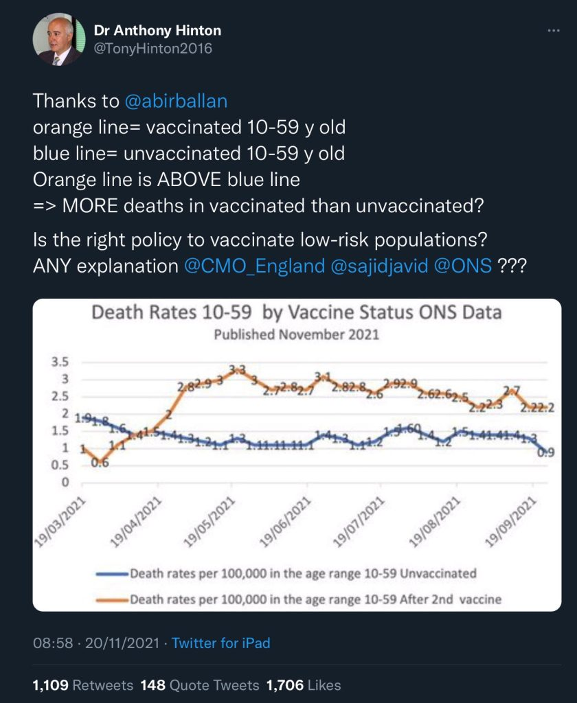
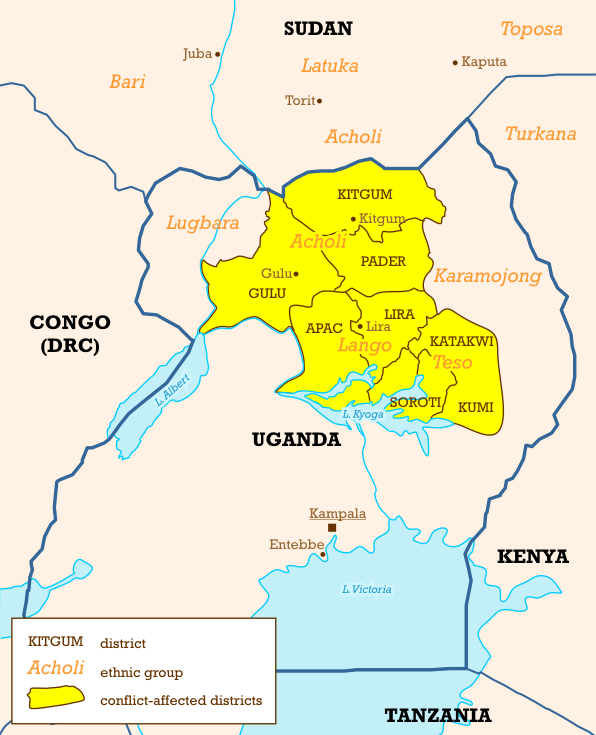
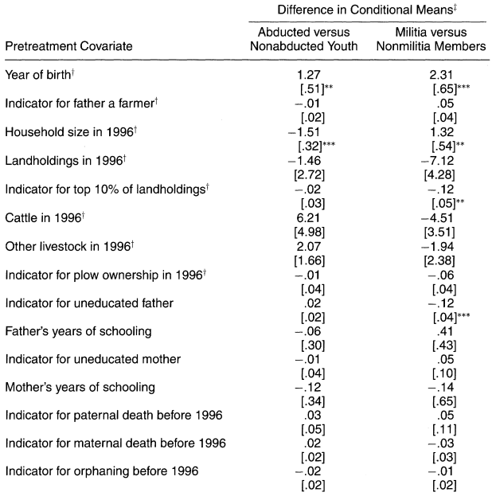
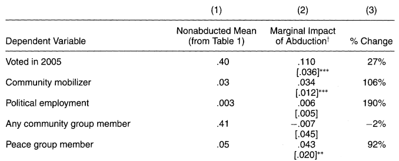
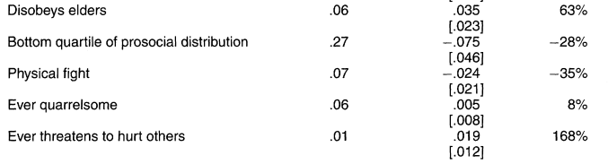
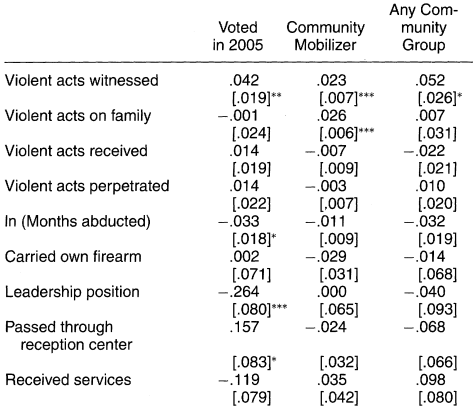

## Quiz 13

::: {style="font-size: 1.5em;"}
Blattman characterizes his study of former combatants in Uganda as a "natural experiment."
What makes his study analogous to an experiment?
:::

## Recap and today's agenda

**Last week.** Effects of war on democratization at the institutional level.

- Acemoglu and Robinson: Conceptual framework for when the franchise is extended
- Przeworksi: evidence about pre- versus post-war periods

. . .

**Today.** War's effect on democracy at the *individual* level.

1. Does war participation increase or decrease political participation?
2. The difficulties of answering this sort of causal question
3. Blattman's "natural experiment" approach in Uganda

# Causation and experiments

## Deceptively different questions

**Do former combatants participate in politics more or less than the general public?**

::: {.fragment fragment-index=2}
- This is a question about *correlation*
- Comparison between different people
:::

**How does combat experience [affect]{.underline} a person's degree of political participation?**

::: {.fragment fragment-index=3}
- This is a question about *causation*
- Comparing the *same* people under different hypotheticals
  1. I don't have combat experience and vote in ~33% of elections
  2. How much more or less would I, Brenton Kenkel, vote if I had been a combatant?
:::

## The fundamental problem of causal inference

We want to calculate the average causal effect --- the difference between

- Each person's frequency of voting if they had been a combatant
- Each person's frequency of voting if they hadn't been

. . .

**Fundamental problem of causal inference:** for each person, we only observe *one* of these two "potential outcomes"

. . .

| Person | Combat experience | %Vote if combatant | %Vote if not | Effect |
|--------|-------------------|--------------------|--------------|--------|
| Jimmy  | No                | ?                  | 70%          | ?      |
| Walter | No                | ?                  | 80%          | ?      |
| Gus    | Yes               | 35%                | ?            | ?      |
| Mike   | Yes               | 20%                | ?            | ?      |

## The fundamental problem of causal inference {visibility="uncounted"}

We want to calculate the average causal effect --- the difference between

- Each person's frequency of voting if they had been a combatant
- Each person's frequency of voting if they hadn't been

**Fundamental problem of causal inference:** for each person, we only observe *one* of these two "potential outcomes"

| Person | Combat experience | %Vote if combatant | %Vote if not | Effect |
|--------|-------------------|--------------------|--------------|--------|
| Jimmy  | No                | [**90%**]{.fg style="--col: #2d6a4f"}  | 70%          | +20pp  |
| Walter | No                | [**100%**]{.fg style="--col: #2d6a4f"} | 80%          | +20pp  |
| Gus    | Yes               | 35%                | [**15%**]{.fg style="--col: #2d6a4f"}  | +20pp  |
| Mike   | Yes               | 20%                | [**0%**]{.fg style="--col: #2d6a4f"}   | +20pp  |

## The fundamental problem of causal inference {visibility="uncounted"}

We want to calculate the average causal effect --- the difference between

- Each person's frequency of voting if they had been a combatant
- Each person's frequency of voting if they hadn't been

**Fundamental problem of causal inference:** for each person, we only observe *one* of these two "potential outcomes"

| Person | Combat experience | %Vote if combatant | %Vote if not | Effect |
|--------|-------------------|--------------------|--------------|--------|
| Jimmy  | No                | [**50%**]{.fg style="--col: #ae2012"}  | 70%          | −20pp  |
| Walter | No                | [**60%**]{.fg style="--col: #ae2012"}  | 80%          | −20pp  |
| Gus    | Yes               | 35%                | [**55%**]{.fg style="--col: #ae2012"}  | −20pp  |
| Mike   | Yes               | 20%                | [**40%**]{.fg style="--col: #ae2012"}  | −20pp  |

## The fundamental problem of causal inference {visibility="uncounted"}

We want to calculate the average causal effect --- the difference between

- Each person's frequency of voting if they had been a combatant
- Each person's frequency of voting if they hadn't been

**Fundamental problem of causal inference:** for each person, we only observe *one* of these two "potential outcomes"

| Person | Combat experience | %Vote if combatant | %Vote if not | Effect |
|--------|-------------------|--------------------|--------------|--------|
| Jimmy  | No                | [**70%**]{.fg style="--col: #6c757d"}  | 70%          | 0pp    |
| Walter | No                | [**80%**]{.fg style="--col: #6c757d"}  | 80%          | 0pp    |
| Gus    | Yes               | 35%                | [**35%**]{.fg style="--col: #6c757d"}  | 0pp    |
| Mike   | Yes               | 20%                | [**20%**]{.fg style="--col: #6c757d"}  | 0pp    |

## Why correlations (usually) don't give us causal effects

"Treated" units may systematically differ from "untreated" ones

Hard to pin down where differences in outcomes come from

- Due to being "treated" as opposed to "untreated"?
- Or due to the baseline differences between groups?  (Or both?)

. . .

Easiest to think about problem in terms of **confounding variables**

- Factors that affect whether you get the "treatment" in the first place
- ...and also directly affect the outcome we're trying to explain

## Why correlations (usually) don't give us causal effects

::: {.columns}
:::: {.column}
{fig-align="center"}
::::
:::: {.column}
High quality studies showed Covid vaccines highly effective at preventing death

Yet we've seen higher Covid death rates in vaccinated populations than in unvaccinated ones

How could this be?

::::: {.fragment}
**Age** is a major confounding variable --- older people at much higher baseline risk, also much more likely to get vaccinated
:::::
::::
::: 

## Confounding and combatants

::: {.callout-note title="Discussion question"}
When we're trying to analyze the effect of being a combatant on political participation, what are some of the most important confounding variables?

Remember, these should be characteristics that ---

1. Increase or reduce chance of being a combatant in the first place
2. Also increase or reduce political participation, independent of combatant status
:::

## The experimental exception

One setting where correlation is a good estimate of the causal effect: **randomized experiment**

- Randomly assign participants to "treatment" and "control"
- Take difference between average outcome in each group

Called the **"gold standard"** of causal inference [(though I don't like that term since the gold standard is actually a poor way to run monetary policy)]{.fg style="--col: #6c757d"}

. . .

Randomization is crucial to make the experiment "work"

Ideal is to have no baseline differences between treated and untreated

With large sample + true randomization, unlikely to have any systematic differences in characteristics --- experiment isolates the causal effect

## Limits of experiments

1. External validity
   - How much does the experimental estimate reflect the real world political process we care about?
   - Artificial lab environment can exaggerate (or minimize) real life effects
   - Recruitable subjects may not represent full population of interest

. . .

2. Feasibility
   - Not always possible to randomize treatment assignment
   - Pertinent example: what would be the obstacles to running a randomized study of how civil war combatant experience affects political participation?

# The "natural experiment" in Uganda

## The Ugandan context

::: {.columns}
:::: {.column}
{fig-align="center"}
::::
:::: {.column}
- After independence, northern peoples dominated military, southerners dominated commerce
- 1986: southerner Museveni seized power via rebel force
- 1988: Joseph Kony formed Lord's Resistance Army (LRA) in the north
- LRA forced recruitment: 60k--80k abductions 1995--2004
- Abduction was arbitrary --- rebels raided isolated homesteads at night, taking all able-bodied people
- Most abductees were adolescent males, held for days to years
::::
:::

## The natural experiment

**Treatment group:** Men abducted by the LRA in northern Uganda

**Control group:** Men from same areas who weren't abducted

**Dependent variables:** Social + political participation

- Voting (if eligible)
- Holding jobs in politics
- Community organization membership
- Anti-social behavior (fighting, disobeying elders)

**Key assumption --- no confounding:** Abducted and non-abducted essentially similar in terms of background characteristics that would predict later political participation

## Validating the no-confounding assumption

::: {.columns}
:::: {.column width="45%"}
Few observable differences b/w abducted and non-abducted

- Born later
- From smaller households

No obvious *economic* differences

Smaller differences than seen between participants and non-participants in voluntary government militia
::::
:::: {.column width="55%"}
{fig-align="center"}
::::
:::

## From violence to voting

::: {.columns}
:::: {.column width="65%"}
{fig-align="center"}

{fig-align="center"}
::::
:::: {.column width="35%"}
Discernibly higher political participation + organization among abductees

Few differences in non-political community activity

Differences in anti-social activity are inconsistent and not statistically significant
::::
:::

## From *witnessing* violence to voting

::: {.columns}
:::: {.column width="45%"}
What predicts more or less participation *among* abductees?

Only consistent predictor is extent of violence witnessed

**Caution:** These results aren't "experimental"

- Being abducted in the first place is random
- ...but what you do in the LRA from there isn't
::::
:::: {.column width="55%"}
{fig-align="center"}
::::
:::

## External validity

Summing up what Blattman has shown:

- Ugandan abductees were disproportionately likely to participate in politics
- Not disproportionately more or less likely to get involved in the community or to engage in antisocial behavior
- Political effects concentrated among abductees who witnessed a lot of violence

::: {.callout-note title="Discussion question"}
What, if anything, does this study tell us about the link between violence and voting in other situations?

What would this study lead you to expect about Russian conscripts returning from Ukraine?
Or about American bomber pilots serving in Iran?
:::

# Wrapping up

## What we did today

1. Basic principles of causal inference
   - Correlation: comparison across different groups
   - Causation: comparing *counterfactual* outcomes for the same unit
   - Fundamental problem of causal inference: can't observe all potential outcomes for same individual
   - Big problem: confounding variables (affect IV + DV)
   - Experiments eliminate confounding

2. Blattman's evidence from Uganda
   - Natural experiment: "random" recruitment via abduction
   - Former abductees disproportionately likely to get involved in politics
   - Mechanism seems to be *witnessing* violence

## To do for next time

**Tuesday, 2:00--3:30.**
My office hours, Commons 326.
Feel free to drop in!

**Wednesday's class.**
Starting unit on nationalism.

- Read the book chapter from Anderson's *Imagined Communities*
- Reading guide to be posted by this evening
