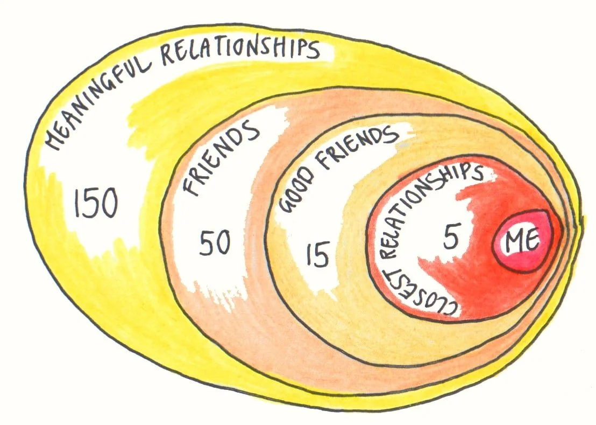
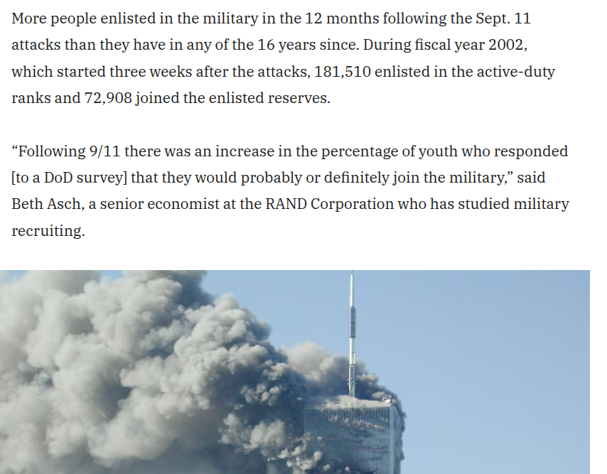
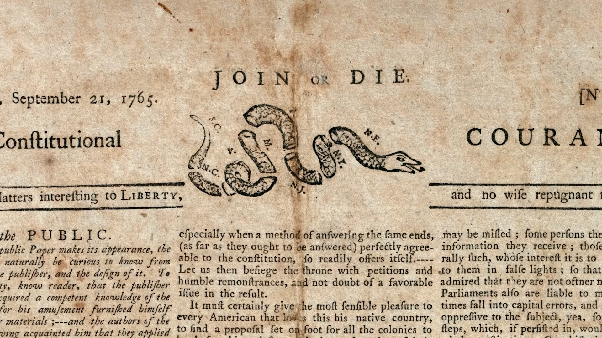
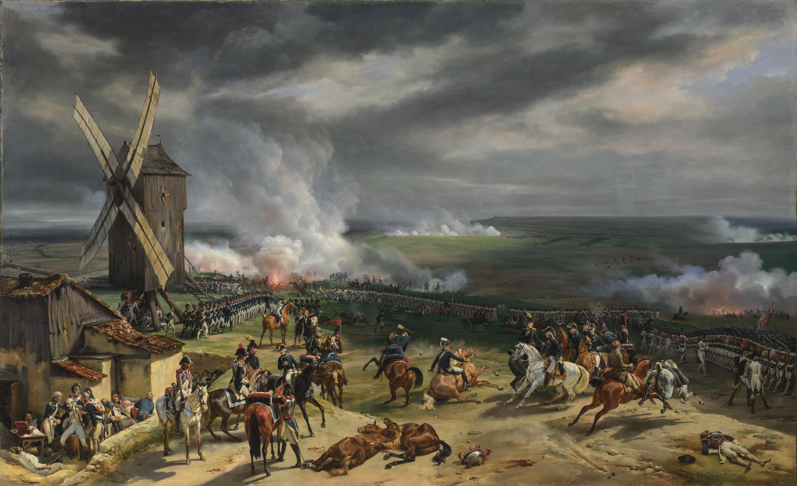
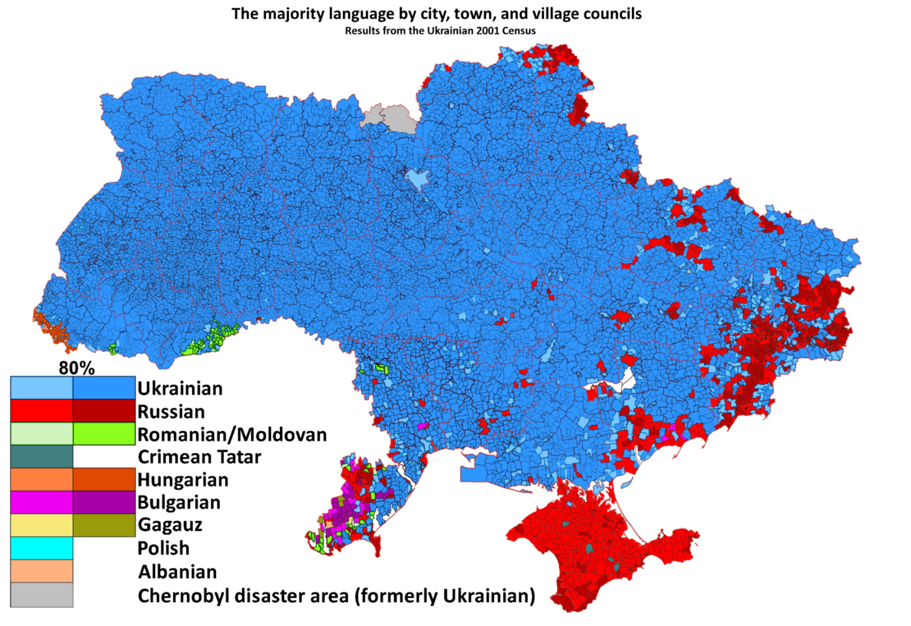

## Recap

**Last time.** Individual effects of civil war violence on political participation.

- Blattman's "natural experiment" in Uganda
- Higher voting + political involvement among former abductees
- No similar increase in community involvement or decrease in antisocial behavior

**Today.** Staying at the individual level, but with a new outcome of interest --- [nationalism]{.alert} as an ideology and organizing principle.

# From state to society

## Scope of concern

If you're not a sociopath, you probably care about the people you know

{fig-align="center"}

... a small group compared to a city, let alone a country

## Social implications

Lots of social/political projects require more than "not a sociopath"

They depend on people caring **about complete strangers**

Some examples:

- National defense requires soldiers
  - Extremely high risk and difficulty
  - Not very well compensated
- Public education requires teachers
  - Reasonably high educational qualifications required
  - Not very well compensated
- Basic liveability of a city requires people to minimize littering, speeding, shoplifting, ...

## The group size paradox

Think back to Olson

Key characteristics of large projects like national defense

- Diffuse benefits --- everyone gains, even if they don't contribute
- Concentrated costs --- only paid by contributors

Large group size $\leadsto$ the difference any one contributor makes is trivial

So we shouldn't expect large societies to coordinate collective efforts

... and yet they do (at least sometimes)

## The leviathan solution

Again back to Olson --- monitoring and punishment by a stationary bandit

- Public projects require tax dollars
- If you don't pay taxes, the IRS will go after you

. . .

Yet a lot of the "inputs" to collective projects aren't coerced

- All-volunteer military in the US since 1973
- No one gets conscripted to be a schoolteacher
- Most people don't litter or run red lights or shoplift even though probability of punishment is very small

. . .

This type of public-spiritedness effectively lowers the "price" the stationary bandit has to pay

## Collective action without coercion

{fig-align="center"}

## Nationalism

Scholarly idea of **nationalism**: personal sense of *community* with other citizens of the same sovereign state

. . .

A sense that I have some sense of shared fate with someone from rural Montana that I've never met and never will meet...

...that I *don't* have with their neighbors across the border in Alberta

. . .

::: {.callout-warning title="Meanings of nationalism"}
"Nationalism" in popular discourse often means thinking one's nation is superior to others

I'd call this **jingoism** instead

Nationalism is a precursor to jingoism, but jingoism isn't always a consequence of nationalism
:::

## Predecessors and competitors

Most countries now are **nation-states**

- Sovereign, territorial state whose citizens have a national identity
- ...whose legitimacy is tied to its identity with that nation

. . .

This is a break from prior historical norms

- State legitimized along imperial, dynastic, or religious lines
- Community among individuals largely religious, not national

And it survived challenges from a Marxist sense of legitimacy and community along lines of **economic class**

# The imagined community

## Troubles with a theory of nationalism

Anderson observes three "paradoxes" about nationalism

1. Nationalism is new, but often portrays nations as old
   - e.g., modern Greeks imagining a continuity with "ancient Greece"
   - ...giving more community to the ancient Greeks than they'd have given themselves

. . .

2. "Nationalism" is universal, yet each manifestation is particular

. . .

3. Nationalism is clearly politically powerful, yet has no political theory behind it
   - Liberalism has Locke, conservatism has Burke, socialism has Marx
   - No equivalent for "nationalism" --- it's a different kind of "ism"

## Defining the nation

Anderson: "it is an imagined political community --- and imagined as both inherently limited and sovereign"

. . .

- Imagined community
  - Doesn't mean fake or made up --- just that the community exists mainly in the realm of ideas
  - Sense of community among people who've never met, never will

. . .

- Limited: Polish nationalists don't hope/think we'll all become Polish

. . .

- Sovereign: Inherently tied to *sovereign states*
  - The "limit" is usually identified with a border
  - ...though these are contested, sometimes violently

## Non-national identities

::: {.callout-note title="Discussion question"}
Think of a **non-national** identity of your own, or that you know others identify with.
Which of Anderson's dimensions does it meet, and which does it fail?

- [ ] Imagined community
- [ ] Limited
- [ ] Sovereign
:::

## What's war got to do with it?

External threat can stir national identity --- e.g., American colonies in late 1700s

{fig-align="center"}

## What's war got to do with it?

External threat can stir national identity --- e.g., French Revolution in 1792

{fig-align="center"}

## What's war got to do with it?

...and nationalism can stir conflict --- e.g., World War I

{fig-align="center"}

## What's war got to do with it?

...and nationalism can stir conflict --- e.g., Ukraine war

{fig-align="center"}

# Wrapping up

## What we did today

1. Why do people sacrifice for strangers?
   - Olson's group size paradox; coercion only goes so far

2. Nationalism
   - Imagined community
   - Limited scope
   - Connected with sovereign state

3. War $\leftrightarrow$ nationalism: threats create identity, identity drives conflict

## To do for next week

**FYI:** I'm *hoping* to have all the drafts graded + feedback sent to you by the end of this week.
I'll *definitely* have them done by the start of next week.

**Monday.** Sambanis, Skaperdas, Wohlforth, "Nation-Building through War."
