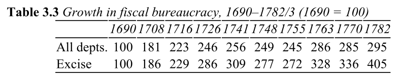
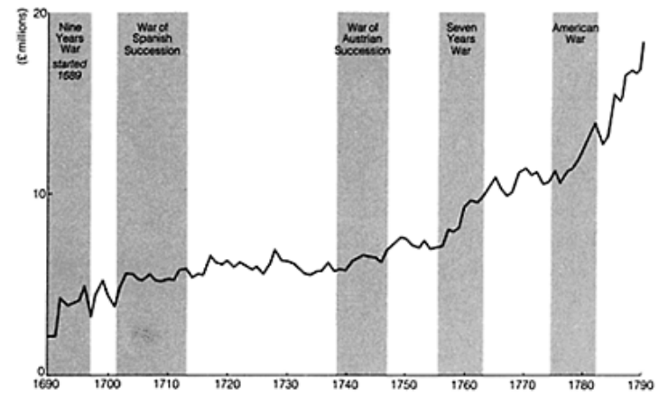
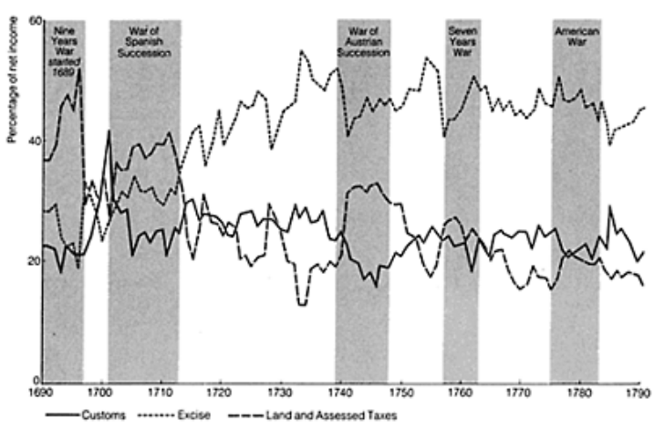

## Extra credit opportunity: Course evaluations

**Course evaluations:** <https://my-vanderbilt.bluera.com/>

**My goal:** No less than 20 completed, ideally 25+

**Extra credit scheme:** Everyone gets extra points depending on response rate

::: {.columns}
:::: {.column}
| Responses | Final grade bump |
|-----------|------------------|
| 0--19     | none             |
| 20        | +0.50            |
| 21        | +0.55            |
| 22        | +0.60            |
| 23        | +0.65            |
| 24        | +0.70            |
| 25+       | +0.75            |
::::
:::: {.column style="color: gray;"}
Inspired by a similar scheme developed by Prof. Emily Ritter.

Also see Myatt and Wallace, *The Economic Journal* 2009, "Evolution, Teamwork, and Collective Action."
::::
::: 

## Extra credit opportunity: Your privacy

::: {.columns}
:::: {.column}
{fig-align="center"}
::::
:::: {.column}
**Before grading:** All I see is how many have been filled out

**After final grades are submitted:** I see the anonymized content of the evaluations

**What I never see:**

- Names of who submitted or didn't
- Any personal identifying info on individual evaluations
- Which scores go with which written comments
::::
:::


## Recap

**Last time (Apr 1).** Darden and Mylonas on linguistic commonality.

- External threats $\leadsto$ incentive to invest in mass national schooling
- Indonesia (high threat) vs. Sub-Saharan Africa (low threat)
- Wrapped up the nationalism unit

**Today.** Brewer, *The Sinews of Power*, chapters 3--4.

- Shifting gears from nationalism to [bureaucracy]{.alert}
- How did the English state transform itself into an effective tax-collecting machine?


## Today's agenda

1. Agency problems --- the conceptual framework
   - What can go wrong when you delegate tasks?
   - The loyalty-competence tradeoff
   - Bureaucracy as a solution
2. War and Britain's tax bureaucracy
   - The transformation of English government, 1600s--1700s
   - The Excise as a bureaucratic model
   - How bureaucratic taxation enabled debt finance


# Agency problems

## The principal-agent relationship

When one person (the **principal**) delegates a task to another (the **agent**)

e.g., the king sets the tax rate, but other people go out and collect the money

Why delegate instead of doing it yourself?

::: {.incremental}
- Lack of time --- you have more important things to do
- Lack of expertise --- the task takes specialized skills
- Lack of knowledge --- can't complete the objective without collecting extra info that you don't have the time or skills to get
:::

## Dangers of delegation

Agents don't always behave as the principal wishes

1. Divergent interests
   - Agent's goals might differ from principal's
   - Tax collector cares about their own pay, not state revenue

. . .

2. Information asymmetry
   - Hard to evaluate if agent's action advanced principal's interests
   - Which tax evaders deserve a break, and which should be punished?

. . .

3. Imperfect monitoring
   - Hard to tell what the agent actually did
   - If tax collections came up short, was the economy bad?  Or are the agents stealing the money?

## Strategies for controlling agents

- Monitoring
  - Set objective performance goals
  - Hire other agents to subjectively evaluate work quality
  - Fire agents who don't meet expectations

. . .

- Incentive alignment
  - Directly tie agents' compensation to satisfaction of principal's goals
  - Requires monitoring, can create perverse incentives too

. . .

- Prior selection
  - Get agents in the first place who need minimal monitoring/incentives

## Agent selection

Two qualities a principal wants from an agent:

- **Loyalty:** the agent wants the principal to be happy
- **Competence:** the agent can do a good job at their tasks

But the most loyal agent is typically not the most competent

::: {.callout-note title="Discussion question"}
What's a time in your own life where you've needed to select an "agent" but faced a loyalty-competence tradeoff?
What factors led you to seek loyalty over competence, or vice versa?
:::

## The loyalty-competence tradeoff

Problem arises even if more loyal agents are *generally* more competent

```{r setup}
#| echo: false
#| message: false
library("tidyverse")
library("cowplot")
library("MASS")

theme_set(theme_cowplot(font_size = 14))

set.seed(47)
n <- 500
x <- mvrnorm(
  n = n,
  mu = c(50, 50),
  Sigma = matrix(c(100, 50, 50, 100), 2, 2)
)
df_tradeoff <- tibble(
  loyalty = x[, 1],
  competence = x[, 2]
) |>
  arrange(loyalty, competence) |>
  mutate(
    on_frontier = map_lgl(row_number(), \(i) {
      !any(loyalty[-i] > loyalty[i] & competence[-i] > competence[i])
    })
  )
```

```{r plot_initial}
plot_base <- df_tradeoff |>
  ggplot(aes(x = loyalty, y = competence)) +
  geom_point(aes(color = on_frontier)) +
  scale_color_manual(
    values = c("FALSE" = "black", "TRUE" = "black")
  ) +
  theme(aspect.ratio = 1) +
  labs(
    title = "Hypothetical agent characteristics",
    x = "Loyalty",
    y = "Competence"
  ) +
  lims(x = c(0, 100), y = c(0, 100))

plot_base
```

## The loyalty-competence tradeoff {visibility="uncounted"}

Problem arises even if more loyal agents are *generally* more competent

```{r plot_middle}
plot_middle <- plot_base +
  scale_color_manual(
    values = c("FALSE" = "gray90", "TRUE" = "black")
  )

plot_middle
```

## The loyalty-competence tradeoff {visibility="uncounted"}

Problem arises even if more loyal agents are *generally* more competent

```{r plot_final}
plot_middle +
  geom_line(
    data = df_tradeoff |> filter(on_frontier),
    color = "red"
  )
```

## The loyalty-competence tradeoff today

::: {.columns}
:::: {.column}
{fig-align="center" width="60%"}

- Confirmed 98--1
- Pushed back on NATO, Syria
- Resigned over policy differences
::::
:::: {.column}
{fig-align="center" width="58%"}

- Confirmed 51--50
- Career in activism/TV
- No public disagreement w/Trump
::::
:::

Same principal, different points on the loyalty-competence frontier

## Politics and the loyalty-competence tradeoff

What political and institutional factors shape a ruler's relative preference for more loyalty as opposed to more competence?

. . .

Some possibilities:

- Executive's fear of insider threat (coup)
- Executive's fear of outsider threat (war, revolution, not being reelected)
- Executive's time horizon
- Legislative or legal constraints

# Bureaucracy

## The bureaucratic ideal

Max Weber (remember him!?) laid out the ideal-type bureaucracy:

- **Hierarchy**: clear chain of command, defined responsibilities
- **Rules**: written procedures, not personal discretion
- **Merit**: selection and promotion based on qualifications
- **Salaries**: officials paid fixed wages, not fees or a cut of revenue
- **Separation**: office and officeholder are distinct --- you don't *own* the job

. . .

"Bureaucracy" in this sense isn't just red tape

Administration as more *systematic*, less *idiosyncratic*

## Bureaucracy as an answer to agency problems

Why is bureaucracy an answer to the agency problems we've been discussing?

- Rules + hierarchy $\leadsto$ easier monitoring
- Merit + salaries $\leadsto$ attracts competent agents
- Separation $\leadsto$ officials are replaceable, reducing their bargaining power

. . .

Bureaucracy makes the loyalty-competence tradeoff less severe

- Institutional controls substitute for personal loyalty
- You don't need to trust the agent as much when the system constrains what they can do

## England before the fiscal-military state

England in the mid-1600s: a remarkably [small]{.underline} government

- Only about 1,200 identifiable permanent officials
- Administration run largely by "Enterprisers" --- private contractors who raised troops, commanded ships, and collected taxes for a fee or a cut

Key features of this system:

- Tax collection often **farmed out** to private individuals who paid the crown a lump sum, then kept whatever they collected beyond that
- Officials paid by **fees**, not salaries --- income depended on how many transactions they processed
- Little distinction between the office and the officeholder
- Minimal oversight, no career structure, no examinations

## From tax farming to direct collection

The agency costs of tax farming:

- Farmer's incentive: extract as much as possible from the population
- Crown's problem: can't verify whether right amount is collected
- Public's problem: loss of trust in crown after dealing with sketchy farmers

. . .

Was supplanted by Weberian administration starting in late 1600s

- Salaried officials --- replaced fee-based compensation
- Career ladders --- graded appointments with progressively higher pay
- Pensions --- gave officials a long-run stake in the system
- Examinations and training --- entry requirements for new recruits
- Internal monitoring --- supervisors, auditors, inspectors


## War and the transformation of government

Many wars with France in the 1600s--1700s

- Nine Years War, 1689--1697
- War of Spanish Succession, 1701--1714
- War of Austrian Succession, 1740--1748
- Seven Years War, 1756--1763

Financing these required much more revenue than old system could deliver




## From political loyalty to professional competence

Early on (1690s--1710s): rulers still prioritized [loyalty]{.alert}

- Political purges after changes of government
- Between June 1694 and June 1695: 121 excise officers (about 10% of the total) discharged for political reasons

Gradual shift toward retaining [competent]{.alert} officials regardless of party

- Cost of firing experienced administrators during wartime became too high
- "Massacre of the Pelhamite Innocents" (1763): even a major politicized purge kept away from lower levels and avoided firing competent administrators


## The Excise

The [Excise]{.alert}: an indirect commodity tax on domestically produced goods --- beer, spirits, soap, candles, leather, paper, and more

Brewer identifies the Excise Office as the closest approximation to Weber's bureaucratic ideal in 18th-century Europe

- Highly centralized hierarchy: Board of Commissioners in London $\rightarrow$ supervisors in the field $\rightarrow$ officers on daily rounds
- Officers passed written and practical exams (decimals, geometry, bookkeeping, the "art of gauging")
- Daily "footwalks" (12--16 miles) and "outrides" (40--50 miles) to inspect producers
- "Removes" system: officers periodically rotated between districts to prevent collusion with local traders

## Growth in revenue



## Huge increase in excise receipts



## Taxes and debt as complements

Thies, Queralt: debt and taxes as [alternative]{.underline} ways to pay for war

Brewer: reliable tax collection and debt finance are [complements]{.alert}

1. Parliament earmarked specific taxes to service specific debts ("funding")
2. Reliable, bureaucratic tax collection $\leadsto$ creditors confident they'd be repaid
3. Creditor confidence $\leadsto$ government could borrow at lower interest rates


# Wrapping up

## Coming up

**Tomorrow.** My office hours, 2:00--3:30pm, Commons 326.

**Wednesday.** Read Chen 2023, "State Formation and Bureaucratization."

- Different context (pre-imperial China), similar questions
- How does warfare drive bureaucratic development?

**Reminder:** Final research paper + revision memo due **Friday, 11:59pm**
