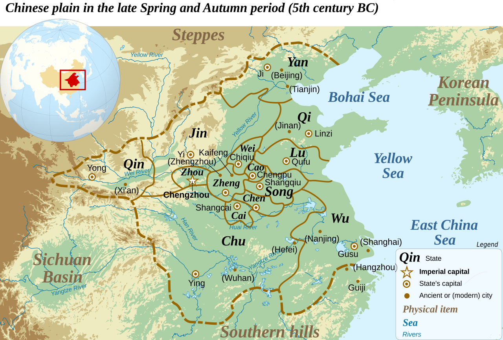
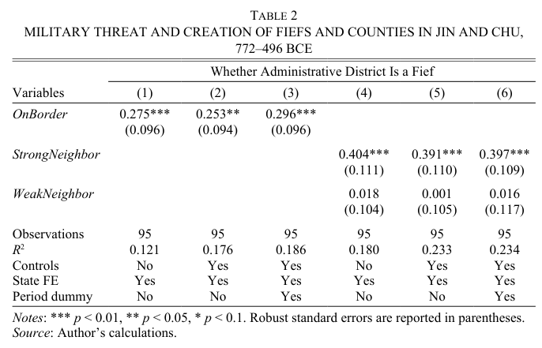
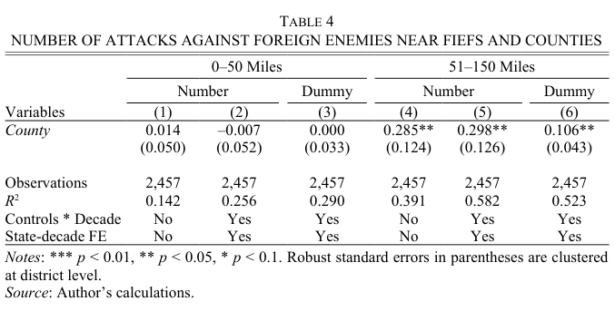

## Recap

**Monday.** Brewer on the British fiscal-military state.

- Principal-agent framework --- divergent interests, information asymmetry, imperfect monitoring
- Loyalty-competence tradeoff in selecting agents
- England's shift from tax farming to the Excise

**Today.** Chen on pre-imperial China.

- Same questions, very different context
- When does warfare push rulers *toward* bureaucratic administration, and when does it push them *away*?

## Today's agenda

1. Finishing up bureaucracy
2. Chen's theory
   - Fief vs. county as alternative principal-agent contracts
   - Different incentives for defensive vs. offensive war
3. Evidence from pre-imperial China

# Bureaucratization

## The bureaucratic ideal

Max Weber (remember him!?) laid out the ideal-type bureaucracy:

- **Hierarchy**: clear chain of command, defined responsibilities
- **Rules**: written procedures, not personal discretion
- **Merit**: selection and promotion based on qualifications
- **Salaries**: officials paid fixed wages, not fees or a cut of revenue
- **Separation**: office and officeholder are distinct --- you don't *own* the job

. . .

"Bureaucracy" in this sense isn't just red tape

Administration as more *systematic*, less *idiosyncratic*

## Bureaucracy as an answer to agency problems

How does bureaucracy help reduce agency problems?

- Rules + hierarchy $\leadsto$ easier monitoring
- Merit + salaries $\leadsto$ attracts competent agents
- Separation $\leadsto$ officials are replaceable, reducing their bargaining power

. . .

Bureaucracy makes the loyalty-competence tradeoff less severe

- Institutional controls substitute for personal loyalty
- You don't need to trust the agent as much when the system constrains what they can do

## Bureaucracy as a cause of agency problems

While solving some agency problems, bureaucracy can create others

::: {.incremental}
- Rigidity: rules designed for typical cases fail on edge cases
- Tunnel vision: distorting actions to hit measurable/numerical targets
- Slow adaptation: hierarchy means less adaptation, especially in crisis
- Rent-seeking: bureaucracy starts trying to aggrandize its own power
- Capture: placing outside interests above the principal's
:::

## Dealing with bureaucracy

::: {.callout-note title="Discussion question"}
What aspects of Vanderbilt are more or less "bureaucratic" in Weber's sense --- hierarchical, rule-bound, oriented more around process than people?

And what are the upsides and downsides of the more bureaucratic parts of the Vanderbilt experience, compared to the less bureaucratic ones?
:::

# War and bureaucratization

## Questions we'll ask

Why did some states develop bureaucratic administration before others?

. . .

To what extent, or in which cases, was warfare an impetus to bureaucratize?

. . .

Once a state has bureaucratized, how does that affect its approach to war?

## Context --- pre-imperial China

::: {.columns}
:::: {.column width="40%"}
**771 BCE:** Zhou collapse

**770--481 BCE:** Spring and Autumn period, gradual fragmentation

**481--221 BCE:** Warring States period, intense competition

**221 BCE:** Qin unification

Chen's focus: Jin and Chu states
::::
:::: {.column width="60%"}
{fig-align="center"}
::::
:::

## Two ways to run a district

::: {.columns}
:::: {.column width="50%" .fragment}
**Fief**

- Granted to a hereditary noble
- Noble [owns]{.alert} the domain --- keeps all tax revenue
- Raises a private army from his own dependents
- Ruler [cannot]{.underline} remove him at will
::::
:::: {.column width="50%" .fragment}
**County (*xian*)**

- Run by an appointed magistrate
- Magistrate draws a [wage]{.alert} --- revenue flows to the ruler
- Commands troops supplied by the ruler
- Ruler [can]{.underline} fire and replace him at will
::::
:::

. . .

The fief is personal property; the county is a bureaucratic post

## Local incentives in defensive war

Foreign army invades the district. Does the local agent fight hard?

::: {.columns}
:::: {.column width="50%" .fragment}
**Fief holder**

- Success $\leadsto$ keeps the domain
- Failure $\leadsto$ loses everything, possibly his life
- Skin in the game --- clear reason to fight hard
::::
:::: {.column width="50%" .fragment}
**County magistrate**

- Success $\leadsto$ keeps a small wage
- Failure $\leadsto$ just loses the wage
- Stakes are low either way --- minimal intrinsic incentive
::::
:::

. . .

Fiefs are [better defenders]{.alert} because of greater intrinsic incentive

## Local incentives in offensive war

Ruler orders an attack on an external enemy. Does the local agent go along?

::: {.columns}
:::: {.column width="50%" .fragment}
**Fief holder**

- Already keeps his domain income --- why risk it?
- Spoils would be his, but so would the casualties
- Little incentive to fight, ruler can't make him
::::
:::: {.column width="50%" .fragment}
**County magistrate**

- Gets only a small cut of the spoils if the attack succeeds
- But if he refuses, the ruler fires him and installs someone who won't
- [Personnel control]{.alert} substitutes for intrinsic motivation
::::
:::

. . .

Counties are [more aggressive]{.alert} because the ruler can force participation

## Ruler's incentives to bureaucratize

The ruler picks the contract [before]{.underline} knowing which contingencies will arise

Core tradeoff:

- High expected [defensive]{.alert} threat $\leadsto$ fief
  - Agent's own property interest substitutes for monitoring
- High expected [offensive]{.alert} opportunity $\leadsto$ county
  - Personnel control lets the ruler compel participation

Two predictions fall out:

1. Fiefs cluster where external threat is high
2. Counties fight more aggressively, especially far from home

## Decision to bureaucratize: research design

**Unit of analysis.** Administrative district in Jin or Chu, 772--221 BCE

**Dependent variable.** Is the district a fief or a county?

**Independent variable.** Is the district on the state's border?

- Proxy for anticipated external threat

**Predicted relationships.**

- Disproportionately fiefs in border districts
- Disproportionately counties in non-border districts
- Strongest differences when neighbor is stable and strong

## Decision to bureaucratize: results

<!-- TODO: export Table 2 from Chen 2023 as tab2.png if a visual is wanted -->

{fig-align="center"}

Border districts [25--30 percentage points]{.alert} more likely to be organized as fiefs

Table 3: bigger differences when neighbor is stable or strong

## Effects of bureaucratization on war: research design

**Unit.** Same districts, observed by decade

**Dependent variable.** District-level aggressiveness

- Number of attacks at 0--50 miles (nearby) vs. 51--150 miles (distant)
- Average distance from the district to its attack sites

**Independent variable.** Is the district a fief or a county?

**Predicted relationships.**

- Fiefs and counties about equally likely to launch close attacks
- Counties more likely than fiefs to launch distant attacks
- Average distance to attack is higher for counties

## Effects of bureaucratization on war: results

{fig-align="center"}

No statistical difference in nearby attack propensity

Counties launch about 0.3 more faraway attacks per decade

Appendix results: avg distance 16--20 miles higher for counties

# Wrapping up

## What we did today

1. Bureaucratization, its upsides and downsides

2. Chen's fief vs. county framework
   - Fiefs give the agent skin in the game --- best for defense
   - Counties give the ruler personnel control --- best for offense

3. Evidence from Jin and Chu
   - Fiefs cluster on threatened borders
   - Counties fight the ruler's distant wars

## What's left from here

**Friday, 11:59pm.** Final research paper + revision memo due.

- Please submit PDFs
- Try to email questions to me by tomorrow, I'm at a conference on Friday

**Evaluation extra credit.** 12 filled out as of last night --- we need 8 more for +0.5, 13 more for +0.75.

**Monday 4/20.** Final exam review --- I'll post a study guide no later than that class, hopefully even earlier.

**Thursday 4/23, 9:00--11:00am.** Final exam.
