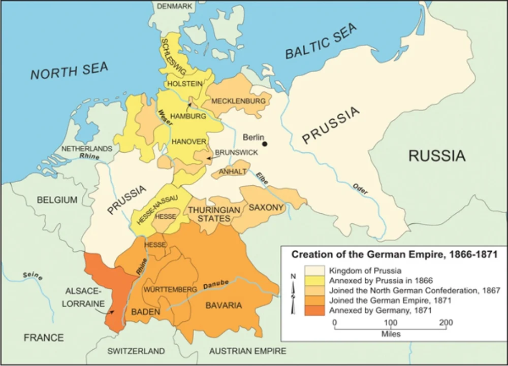
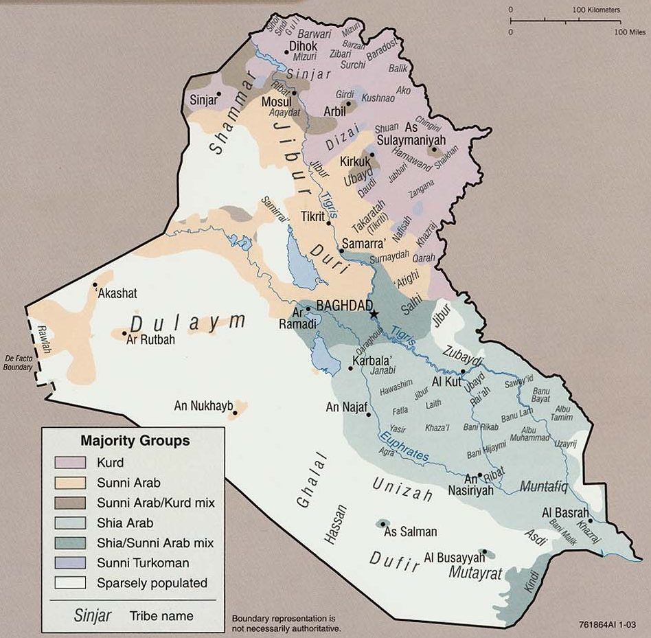
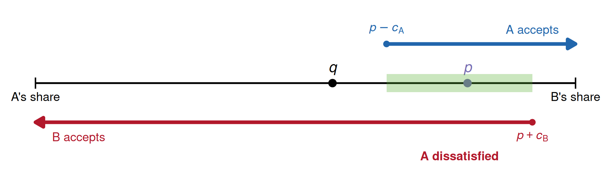

## In case you don't read your email

- **No lectures next week** (Apr 6--8)
  - Replaced by final paper consultations
  - <https://calendly.com/brenton-kenkel/wasd-paper-consultations>
- **Reading schedule changed**
  - Weds 4/1: Darden and Mylonas
  - Mon 4/13: Brewer
  - Weds 4/15: Chen
- **Revision memo templates** now posted in Brightspace

## Recap

**Last time.** Nationalism as a political ideology

- Relatively new, past couple hundred years
- Imagined, limited, sovereign (Anderson)

**Today.** Sambanis, Skaperdas, Wohlforth, "Nation-Building through War."

## Today's agenda

1. The nation-building problem
2. How war builds nations (and thus states)
3. ...and how that in turn makes war

# The nation-building problem

## Alternatives to national identity

If people don't identify with the nation, how **do** they identify?

One alternative: sub-national identity

- City, state, province, etc.
- Particularly plausible when country has been built from pieces

Another alternative: identities that don't correspond to borders

- Religious identity
- Ethnic/linguistic identity

Nation-state's challenge: make nationalism more appealing than alternatives

## Sub-national identities in unification-era Germany

{fig-align="center"}

Bismarck's challenge: how to bring the south into a German identity?

## Ethnic and religious identities in post-2003 Iraq

{fig-align="center"}

US occupation's challenge: how to foment functioning Iraqi democracy?

## Consequences of non-national identification

When people identify with sub-national groups instead of the nation, two bad things happen from the state's perspective:

. . .

**1. Undermines public good provision**

- Why invest in national infrastructure, defense, education if you only care about your own group?
- State capacity suffers when groups don't cooperate

. . .

**2. Fuels internal conflict**

- Groups compete over resources, territory, political power
- Fighting is costly --- wastes resources that could go toward productive activity

## The reinforcing cycle

 

<pre style="font-size: 0.6em; line-height: 1.3; overflow: visible; border: none; background: none; box-shadow: none;">
    ┌─────────────────────────────────┐
    │   Sub-national identification   │
    └──────┬───────────────┬──────────┘
           │               │
           ▼               ▼
    ┌────────────┐  ┌──────────────┐
    │ Low state  │  │   Internal   │
    │ capacity   │◄─┤   conflict   │
    └─────┬──────┘  └──────┬───────┘
          │                │
          └────────┬───────┘
                   │
                   ▼
          ┌─────────────────┐
          │ Weaker national │
          │    identity     │
          └─────────────────┘
</pre>

::: {.aside}
thanks Claude for the beautiful ASCII art of my hand-drawn scribbles
::: 

# How war builds nations

## International level: status competition

States exist in a competitive, anarchic international system

- Competing over territory, prestige, influence
- A state's **status** depends on its performance relative to rivals

Victory in war raises a state's international status --- defeat lowers it

. . .

Why does this matter domestically?

- People like to identify with **high-status groups**
- More attractive to identify with a nation that's successful in battle

## National level: the identification shift

When the nation's status rises after a military victory, the **calculus of identification** changes

. . .

Each group weighs:

- [Status bonus]{.alert}: prestige of identifying with a winning nation
- [Distance cost]{.alert}: cultural/social distance from the national identity

. . .

**After victory:** status bonus goes up $\Rightarrow$ more people identify nationally

- Even groups that were previously non-nationalist may shift
- The perceived benefits of being part of the nation outweigh the costs of giving up group identity

## Individual level: effort allocation

Key idea in SSW: identification changes individual **behavior**, not just attitudes

How I think about the individual decision calculus:

| Activity | Description | Effect on the state |
|---|---|---|
| **State capacity** | Invest in public goods, institutions | Great for the state |
| **Private production** | Work for personal gain | Good --- taxable |
| **Conflict** | Fight other groups for resources | Bad for the state |

Effects of nationalism:

- State capacity building $\uparrow$
- Conflict with other groups $\downarrow$

# Nation-building as a cause of war

## Tilly vs. SSW

Tilly's story is essentially chronological

- War happened $\rightarrow$ states that built capacity survived $\rightarrow$ those states made more war
- A pattern, but not a *reason* --- rulers don't sit around thinking "I should start a war to build state capacity"

. . .

SSW add [strategic nation-building]{.alert}

- Forward-looking rulers **anticipate** nation-building if victorious
- Makes war *more attractive* than it would be based on territorial gains alone

## How nation-building can break the bargaining range

{fig-align="center"}

Remember back to the bargaining model of war

War costly $\leadsto$ bargain available

But the "costly" assumption can break if victory builds one state, but defeat won't break the other

## The Bismarck strategy

**Prussia's problem:** Southern German states resisted unification

- Anti-Prussian sentiment was *growing* through the 1860s
- Soft approaches (customs union, economic incentives) were failing
- Bismarck: "German unity is likely to be fostered by violent events"

**Bismarck's solution:** Engineer a crisis with France

- Provoked a war that he expected Prussia to win
- Deliberately framed the conflict as a Franco-German *status contest*
- Goal: victory over France would make "Germany" a high-status identity that Southerners would want to join

## The war's effects on identification

War had exactly the effects SSW's model predicts

- Large-scale mobilization fostered a sense of shared purpose
- Southern populations that had elected anti-unification parties in 1868--69 now demanded to join the Reich
- Bavaria's government had to bow to popular nationalist sentiment

Result was massive state-building

- North German Constitution extended to the new Reich
- New institutions: central bank, common currency, unified legal system
- Investments in social welfare and public education
- States that had initially resisted (Bavaria, Württemberg) accepted unification of German laws

# Wrapping up

## What we did today

1. The nation-building problem
   - Sub-national identities undermine public goods and fuel conflict
   - These two problems reinforce each other in a vicious cycle

2. How war builds nations
   - Victory $\rightarrow$ higher national status $\rightarrow$ national identification
   - National identification $\rightarrow$ more state capacity, less conflict

3. SSW vs. Tilly on why rulers start wars
   - Tilly: war $\rightarrow$ state building is a historical pattern
   - SSW: war $\rightarrow$ nation building is a *strategic choice* by forward-looking rulers
   - Bismarck and the Franco-Prussian War as the key illustration

## Rest of this week

**Reminder.** <https://calendly.com/brenton-kenkel/wasd-paper-consultations>

**Tomorrow.** My office hours, 2:00--3:30pm.

**Wednesday.** Read paper by Darden and Mylonas on territorial integrity and mass schooling.

**Friday.** Seungho's office hours, 3:00--4:30pm.
